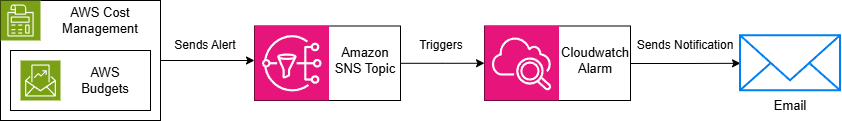

# AWS Budget & Billing Alarm Project

A hands-on implementation of a proactive cost governance system on AWS. This project demonstrates how to monitor spending, detect anomalies, and automate responses using core AWS cost management and monitoring services.

## 📋 Project Overview

This project establishes a multi-layered defense against unexpected AWS costs. It combines threshold-based budgeting with machine-learning-powered anomaly detection and automated remediation actions, following AWS Well-Architected Framework best practices for cost optimization.

**Core Objectives:**
1.  **Monitor Spending:** Track costs against defined budgets at multiple levels (total, service-specific, tag-based).
2.  **Detect Anomalies:** Use machine learning to identify unusual spending patterns without manual threshold setting.
3.  **Automate Response:** Trigger automated actions (like restricting resource creation) when budgets are exceeded.
4.  **Centralize Alerts:** Deliver all notifications through a unified Amazon SNS and CloudWatch Alarms pipeline.

## 🏗️ Architecture & Data Flow

The system uses a serverless, event-driven architecture. The diagram below illustrates how alerts flow from detection to notification and automated action.



## 🚀 Implementation Steps

### Phase 1: Foundation - IAM, SNS, and Core Budget

#### 1. IAM Permissions
Ensure your user/role has permissions for `aws.budgets`, `cloudwatch`, `sns`, and `cost-explorer`.

#### 2. Create SNS Topic
* Go to **Amazon SNS Console** > **Topics** > **Create topic**.
* **Type:** Standard.
* **Name:** `BudgetAlarmsTopic`.
* Create a subscription to this topic with your **email address** and confirm the subscription.

#### 3. Create a Core Cost Budget
* Go to **AWS Budgets Console** > **Create budget** > **Cost budget**.
* **Name:** `Monthly-Cost-Budget`.
* Set your **monthly limit**.
* **Configure Alerts:** Add an alert at (e.g., 90%) and select the `BudgetAlarmsTopic` SNS topic for notification.

### Phase 2: Granular Budgets & Advanced Monitoring

#### 1. Create Service-Specific Budgets
* Create a new **Cost budget**.
* Under **Advanced options**, add a filter: **Service** = `Amazon Bedrock` (or any other service).
* Set a limit and configure an alert to the same SNS topic.

#### 2. Implement Cost Anomaly Detection
* Go to **Billing Console** > **Cost Anomaly Detection** > **Create monitor**.
* Choose an **AWS managed monitor** (e.g., "All AWS services").
* Add an alert subscription to the `BudgetAlarmsTopic`.
* Set a **minimum alert threshold** (e.g., $100.00).

### Phase 3: Automation & Refined Alerting

#### 1. Create CloudWatch Alarm for SNS
* Go to **CloudWatch Console** > **Alarms** > **Create alarm**.
* **Select metric:** Search for your SNS Topic and choose `NumberOfMessagesPublished`.
* **Conditions:** Static / Greater / Threshold > 0.
* **Notification:** Trigger the **In alarm** state to send a message to the `BudgetAlarmsTopic`.

#### 2. Implement Automated Budget Actions

**A. Create IAM Role for Budgets**
* **IAM Console** > **Create role**.
* **Trusted entity:** AWS service > Budgets.
* **Attach policy:** `AWSBudgetsActionsWithAWSResourceControlAccess`.

**B. Create a Restrictive IAM Policy**
Create a policy to block resource creation:
```json
{
    "Version": "2012-10-17",
    "Statement": [
        {
            "Sid": "DenyBedrockInference",
            "Effect": "Deny",
            "Action": [
                "bedrock:InvokeModel",
                "bedrock:InvokeModelWithResponseStream"
            ],
            "Resource": "*"
        }
    ]
}
```

**C. Attach Action to Budget**
- Edit your **Monthly-Cost-Budget**.
- On the alert configuration, click **Add action**.
- Select the IAM role and the restrictive policy. Choose **Auto execution**.

## ⚙️ Configuration Summary
### AWS Budgets Setup
| Budget Name | Scope (Filter) | Threshold | Action |
|-------------|----------------|-----------|--------|
| Monthly-Cost-Budget | Entire Account | 90% & 100% | Notify SNS, Apply IAM Policy at 100% |
| EC2-Monthly-Budget | Service: Amazon Bedrock | 80% | Notify SNS |

### IAM Policy & Role
- **Role Name:** `AWSBudgetsActionsRole`
- **Trust Policy:** Allows AWS Budgets service to assume the role.
- **Permissions Policy:** `AWSBudgetsActionsWithAWSResourceControlAccess` (Managed Policy) + Custom Deny policy.

## 🧪 Testing the Project
**1. Trigger a Budget Alert:**
- Simulate cost by launching resources (e.g., an EC2 instance) that would push you over a test budget threshold set very low (e.g., $1).
- **Expected Result:** You receive an email from the SNS topic within 15 minutes.

**2. Verify CloudWatch Alarm:**
- Go to CloudWatch > Alarms. The `Budget-Alarm-Triggered` alarm should change to the **In alarm** state (orange) when a message is published.

**3. Test Budget Action (Carefully!):**
> **Warning:** Test this in a development/sandbox account.
1. Exceed a budget with an attached Deny policy.
2. **Expected Result:** Attempts to perform the denied actions (e.g., Inference with Bedrock model) should fail with an `"UnauthorizedOperation"` error.


## 🧹 Cleanup Instructions
To avoid unnecessary charges, remove all project resources:
1. **AWS Budgets Console:** Delete all created budgets (`Monthly-Cost-Budget`, `EC2-Monthly-Budget`, etc.).
2. **AWS Cost Anomaly Detection Console:** Delete the anomaly monitor.
3. **CloudWatch Console:** Delete the `Budget-Alarm-Triggered` alarm.
4. **SNS Console:** Delete the `BudgetAlarmsTopic` and its subscriptions.
5. **IAM Console:** Delete the `AWSBudgetsActionsRole` and any custom deny policies you created.