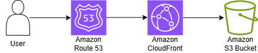

# 🌐 AWS Static Website Hosting Project

A hands-on project demonstrating how to host a secure, high-performance static website using core AWS services: **Amazon S3** for storage, **Amazon CloudFront** as a Content Delivery Network (CDN), and **Amazon Route 53** for DNS management.

## 📋 Project Overview

This project involved deploying a personal portfolio website (built with React, Typescript, and Tailwind CSS) to the cloud. The goal was to learn and implement fundamental AWS infrastructure for web hosting, focusing on scalability, cost-efficiency, and global availability.

**Live Demo:** [https://rizki-putra.com](https://rizki-putra.com)

## 🏗️ Architecture & Flow

The application uses a serverless, static hosting architecture. The diagram below illustrates how user requests are served:



**Key Architecture Decisions:**
*   **S3 for Storage:** Chosen for its durability, simplicity, and perfect fit for static content.
*   **CloudFront as CDN:** Added to provide HTTPS encryption (via AWS Certificate Manager), reduce latency by caching at edge locations, and improve security.
*   **Route 53 for DNS:** Used for reliable domain management and free Alias records to AWS resources.

## 🚀 Implementation Steps

### Phase 1: Website & S3 Bucket Setup
1.  **Develop Static Website:** Created a simple portfolio website with `index.html`.
2.  **Create S3 Bucket:** Logged into the AWS Console, created a bucket named exactly `rizki-putra.com`, and enabled **Static Website Hosting** in the bucket properties.
3.  **Configure Bucket Policy:** Applied a public read policy to allow the website to be accessed.
    ```json
    {
        "Version": "2012-10-17",
        "Statement": [
            {
                "Sid": "PublicReadGetObject",
                "Effect": "Allow",
                "Principal": "*",
                "Action": "s3:GetObject",
                "Resource": "arn:aws:s3:::rizki-putra.com/*"
            }
        ]
    }
    ```
4.  **Upload Files:** Uploaded all website files to the bucket.

### Phase 2: Content Delivery & Security with CloudFront
1.  **Create CloudFront Distribution:**
    *   Origin: Set to the S3 bucket's static website endpoint.
    *   Viewer Protocol Policy: **Redirect HTTP to HTTPS** for security.
    *   Alternate Domain Names (CNAMEs): Added `rizki-putra.com`.
    *   SSL Certificate: Requested a free public certificate from **AWS Certificate Manager (ACM)** for the domains.
    *   Default Root Object: Set to `index.html`.

### Phase 3: Custom Domain with Route 53
1.  **Register Domain:** Purchased the domain `rizki-putra.com` via Route 53.
2.  **Create Hosted Zone:** Route 53 automatically created a hosted zone for the domain upon registration.
3.  **Create Alias Records:** Created one "A" type Alias records in the hosted zone:
    *   Record 1: Name left blank, pointed to the CloudFront distribution.

## 💰 Cost Management & Free Tier

A primary objective was to minimize costs. This setup can run **within the AWS Free Tier and free usage limits** for a low-traffic personal site.

| Service | Free Tier / Free Usage | Notes |
| :------ | :--------------------- | :---- |
| **Amazon S3** | 5 GB storage, 20k GET requests/month (first 12 months) | More than sufficient for a portfolio. |
| **Amazon CloudFront** | 1 TB of data transfer out & 10M HTTP/HTTPS requests/month (Perpetual Free Tier) | The `$0/month Free Plan` (1M requests, 100 GB) is also a good choice. |
| **AWS Route 53** | $0.50 per hosted zone / month. **Alias queries to AWS resources are free.** | The only fixed monthly cost for this project. |
| **Domain Name** | Not free; standard annual registration fee. | The main project expense. |

**⚠️ Important:** Always monitor your usage in the **AWS Billing & Cost Management Dashboard**.
