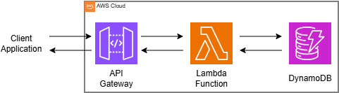

# Serverless API Project
A hands-on implementation of a production-ready, serverless REST API built with AWS API Gateway, Lambda, and DynamoDB. This project demonstrates how to build scalable, cost-efficient backend systems without managing servers.

## 📋 Project Overview
This project implements a fully functional Task Management API with complete CRUD operations. It follows serverless architecture principles where AWS Lambda functions handle business logic, DynamoDB provides NoSQL data persistence, and API Gateway manages HTTP endpoints and routing.

**Live API Endpoint**: https://kcmg4jp0jj.execute-api.ap-southeast-2.amazonaws.com/prod

## 🏗️ System Architecture
The API follows an event-driven serverless architecture:



**Key Components**

- Amazon API Gateway: Manages REST endpoints, request routing, and authentication
- AWS Lambda: Executes business logic in a serverless, event-driven manner
- Amazon DynamoDB: Provides NoSQL database with automatic scaling
- IAM Roles: Secure permission management between services

## 🛠️ Technical Implementation
### Prerequisites
- AWS Account with IAM access
- AWS CLI configured locally (aws configure)
- Node.js 18.x or higher (for Lambda runtime)

### IAM Role Setup
Create an execution role for Lambda functions with appropriate permissions:

```json
{
    "Version": "2012-10-17",
    "Statement": [
        {
            "Effect": "Allow",
            "Action": [
                "logs:CreateLogGroup",
                "logs:CreateLogStream",
                "logs:PutLogEvents"
            ],
            "Resource": "arn:aws:logs:*:*:*"
        },
        {
            "Effect": "Allow",
            "Action": [
                "dynamodb:GetItem",
                "dynamodb:PutItem",
                "dynamodb:UpdateItem",
                "dynamodb:DeleteItem",
                "dynamodb:Scan"
            ],
            "Resource": "arn:aws:dynamodb:region:account-id:table/Tasks"
        }
    ]
}
```
### DynamoDB Table Configuration
```bash
aws dynamodb create-table \
    --table-name Tasks \
    --attribute-definitions \
        AttributeName=taskId,AttributeType=S \
    --key-schema \
        AttributeName=taskId,KeyType=HASH \
    --billing-mode PAY_PER_REQUEST
```

## 📖 API Documentation
### Base URL
https://kcmg4jp0jj.execute-api.ap-southeast-2.amazonaws.com/prod

### Endpoints
**1. Create Task**
- POST /tasks
- Request Body:

```json
{
    "title": "Learn AWS Serverless",
    "description": "Build complete CRUD API",
    "completed": false
}
```
- Response (201 Created):

```json
{
    "message": "Task created successfully",
    "task": {
        "taskId": "uuid-generated-here",
        "title": "Learn AWS Serverless",
        "description": "Build complete CRUD API",
        "createdAt": "2024-01-15T10:30:00Z",
        "completed": false,
        "updatedAt": null
    }
}
```

**2. Get All Tasks**
- GET /tasks
- Optional Query Parameters:
    - `limit`: Number of items to return (default: 100, max: 1000)
    - `lastKey`: Pagination token for next page
- Response (200 OK):

```json
{
    "tasks": [...],
    "lastEvaluatedKey": null,
    "count": 5,
    "scannedCount": 5
}
```

**3. Get Single Task**
- GET /tasks/{id}
- Response (200 OK):

```json
{
    "taskId": "uuid-generated-here",
    "title": "Learn AWS Serverless",
    "description": "Build complete CRUD API",
    "createdAt": "2024-01-15T10:30:00Z",
    "completed": false,
    "updatedAt": null
}
```

**4. Update Task**
- PUT /tasks/{id}
- Request Body (partial updates supported):

```json
{
    "title": "Updated Title",
    "completed": true
}
```

- Response (200 OK):

```json
{
    "message": "Task updated successfully",
    "task": {...}
}
```

**5. Delete Task**
- DELETE /tasks/{id}
- Response (200 OK):

```json
{
    "message": "Task deleted successfully",
    "deletedTaskId": "uuid-generated-here"
}
```

## 🚀 Deployment Steps
1. Create Lambda Functions

```bash
# Create deployment packages for each function
cd lambda-functions
npm install
zip -r function.zip .
```

2. Deploy Lambda Functions

```bash
aws lambda create-function \
    --function-name createTask \
    --runtime nodejs18.x \
    --role arn:aws:iam::account-id:role/LambdaDynamoDBAccessRole \
    --handler index.handler \
    --zip-file fileb://function.zip
```

3. Create API Gateway REST API

```bash
# Create REST API
aws apigateway create-rest-api --name 'ServerlessTodoAPI'

# Create resources and methods
aws apigateway create-resource \
    --rest-api-id {api-id} \
    --parent-id {root-resource-id} \
    --path-part 'tasks'

# Deploy API
aws apigateway create-deployment \
    --rest-api-id {api-id} \
    --stage-name 'prod'
```

4. Configure CORS (For Web Frontend)
Add CORS headers in Lambda responses:

```javascript
headers: {
    'Content-Type': 'application/json',
    'Access-Control-Allow-Origin': '*',
    'Access-Control-Allow-Methods': 'GET,POST,PUT,DELETE,OPTIONS'
}
```
## 🔍 Testing the API
**Using cURL**
```bash
# Create a task
curl -X POST https://your-api-id.execute-api.region.amazonaws.com/prod/tasks \
  -H "Content-Type: application/json" \
  -d '{"title": "Test Task", "description": "Test Description"}'

# Get all tasks
curl -X GET https://your-api-id.execute-api.region.amazonaws.com/prod/tasks

# Update a task
curl -X PUT https://your-api-id.execute-api.region.amazonaws.com/prod/tasks/task-id-here \
  -H "Content-Type: application/json" \
    -d '{"completed": true}'
```

## ⚠️ Error Handling
The API implements comprehensive error handling:

| HTTP Status | Error Code       | Description             |
|-------------|------------------|-------------------------|
| 400         | VALIDATION_ERROR | Input validation failed |
| 404         | NOT_FOUND        | Resource not found      |
| 500         | INTERNAL_ERROR   | Server-side error       |

Example Error Response:

```json
{
    "error": "Validation failed",
    "details": ["Title is required", "Title cannot exceed 200 characters"]
}
```
## 💰 Cost Optimization
### Free Tier Limits
- AWS Lambda: 1M requests/month free
- API Gateway: 1M REST API calls/month free
- DynamoDB: 25 GB storage free (permanent)
- Data Transfer: 1 GB/month out to internet free

### Cost Monitoring Setup
```bash
# Create billing alarm
aws cloudwatch put-metric-alarm \
    --alarm-name MonthlyCostAlert \
    --metric-name EstimatedCharges \
    --namespace AWS/Billing \
    --statistic Maximum \
    --period 21600 \
    --evaluation-periods 1 \
    --threshold 10.0 \
    --comparison-operator GreaterThanThreshold
```

## 🧪 Testing Strategy
### Unit Tests (Jest)
```javascript
// Example test for createTask
test('should create task with valid input', async () => {
    const event = {
        body: JSON.stringify({
            title: 'Test Task',
            description: 'Test Description'
        })
    };
    
    const result = await handler(event);
    expect(result.statusCode).toBe(201);
});
```

### Integration Tests
```bash
# Run integration test suite
npm run test:integration
```

## 🗑️ Cleanup Instructions
To avoid unnecessary charges:

```bash
# Delete API Gateway
aws apigateway delete-rest-api --rest-api-id {api-id}

# Delete Lambda functions
aws lambda delete-function --function-name createTask
aws lambda delete-function --function-name getAllTasks
aws lambda delete-function --function-name getTaskById
aws lambda delete-function --function-name updateTask
aws lambda delete-function --function-name deleteTask

# Delete DynamoDB table
aws dynamodb delete-table --table-name Tasks

# Delete IAM role
aws iam delete-role --role-name LambdaDynamoDBAccessRole
```