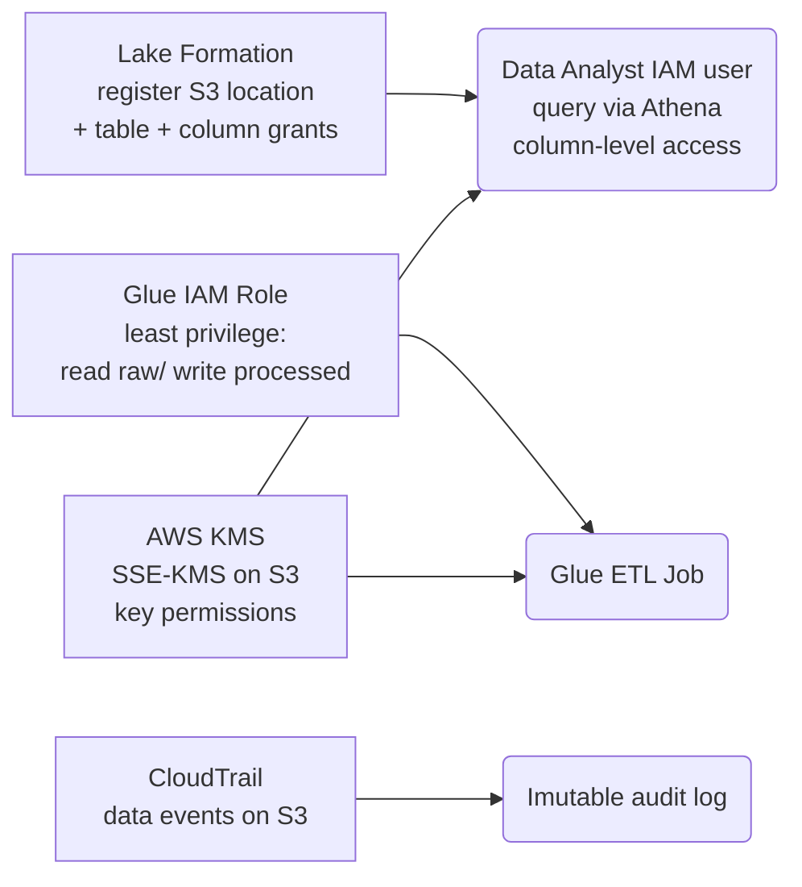

The **Data Governance Framework** project is all about fine‑grained access control and auditability – directly hitting the Security & Governance domain of the DEA‑C01 exam. You’ll implement a complete zero‑trust model for the data lake you built earlier (S3 + Glue + Athena) using Lake Formation, IAM least‑privilege roles, KMS encryption, and CloudTrail auditing.

We’ll reuse the `de-project-data-lake-<account-id>` bucket with `rawData/` and `processedData/` from the Serverless Data Lake project. If that no longer exists, recreate the bucket with those folders and copy a small Parquet file into `processedData/` (e.g., the IoT processed data). Even a dummy file works for testing permissions.

---

### 🗺️ What you’ll build


---

## 🛠️ Prerequisites
- The same AWS account/region as before.
- The S3 bucket `de-project-data-lake-<account-id>` with `rawData/` and `processedData/` folders and some data (if not, create it and upload a dummy Parquet file to `processedData/`). We’ll use the IoT processed table (`iot_database.processed_iot_data`). If missing, create a small Parquet file and run a Glue Crawler to catalog it as `processed_iot_data`.
- IAM user with administrator permissions for setup.

---

## Step 1: Set up Lake Formation and register the data lake

### 1.1 Register the S3 location
1. In Lake Formation, under **Administration** → **Data lake locations**. Click **Register location**.
2. Amazon S3 path: `s3://de-project-data-lake-<account-id>/processedData/` (or the whole bucket; we’ll register just processed for now). Click **Register location**.

### 1.2 Grant Lake Formation permissions on the table
We want a “Data Analyst” user to query only specific columns (e.g., `device_id`, `temperature`) from the `processed_iot_data` table, not sensitive ones like `humidity`.

1. **Create a Data Analyst IAM user** (if you don’t have one):
   - IAM → IAM Users → **Create user** → name `data-analyst`, Check the **Provide user access to the AWS Management Console** → create custom password, uncheck the **Users must create a new password at next sign-in** → Create User.
2. Add `AmazonAthenaFullAccess` policy to the 'data-analyst' user. Add this inline policy to the user.

```json
{
    "Version": "2012-10-17",
    "Statement": [
        {
            "Effect": "Allow",
            "Action": [
                "s3:PutObject",
                "s3:GetObject",
                "s3:ListBucket"
            ],
            "Resource": [
                "arn:aws:s3:::de-project-data-lake-<account-id>",
                "arn:aws:s3:::de-project-data-lake-<account-id>/*"
            ]
        }
    ]
}
```

This will make sure the user could access and query in Athena.

2. In Lake Formation, under **Permissions** → **Data permissions** → **Grant**.
   - **Principals**: IAM users and roles → select user `data-analyst`.
   - **LF-Tags or catalog resources**: choose **Named data catalog resources** → Choose catalog.
   - Database: `iot_database`
   - Table: `processed_iot_data`
   - **Table permissions**: **Select**.
   - **Data permissions**: **Column‑based access** → **Include columns** → add `temperature`. (Omit `humidity`.)
   - Grant.
3. Repeat the grant for the database `iot_database` at least **Describe** permission so the user can list tables. For the database, choose **Named resource**, database `iot_database`, and grant **Describe**.

Now the data-analyst user has no S3 access, but they will query via Athena using Lake Formation’s temporary credentials.

---

## Step 2: Test column‑level access with Athena

1. Log into the AWS Console as the `data-analyst` user (open an incognito window or switch roles).
2. Open **Athena**. Set a query result location (e.g., `s3://de-project-data-lake-<account-id>/athena-results/`; the user does not need S3 permissions—Athena writes results using the workgroup’s permissions or the user’s Lake Formation vended credentials). If you get permission errors, we’ll fix them afterward.
3. Run:
   ```sql
   SELECT humidity FROM iot_database.processed_iot_data;
   ```
   You will get an error: `Insufficient Lake Formation permissions` because you tried to select `humidity` which is denied. Now run:
   ```sql
   SELECT device_id, temperature FROM iot_database.processed_iot_data;
   ```
   This should succeed and return only the two allowed columns.

> 🔧 Troubleshooting: If the analyst still can’t query, the Athena workgroup may need the setting “Enable Lake Formation integration” under the workgroup’s details. Go to Athena → Workgroup: primary → **Edit** → expand **Advanced** → check **Use Lake Formation for fine‑grained access control** and set an IAM role (the workgroup’s service role). But by default, if you use the primary workgroup and your user’s permissions are managed by Lake Formation, it should work. If not, create a new workgroup and enable Lake Formation there.

---

## Step 3: Create a Glue IAM role with least privilege

We’ll craft a role that the Glue ETL job will assume, with only the exact permissions needed: read `rawData/`, write `processedData/`, and later use KMS.

1. IAM → **Policies** → **Create policy** (JSON):
   ```json
   {
       "Version": "2012-10-17",
       "Statement": [
           {
               "Effect": "Allow",
               "Action": [
                   "s3:GetObject"
               ],
               "Resource": "arn:aws:s3:::de-project-data-lake-<account-id>/rawData/*"
           },
           {
               "Effect": "Allow",
               "Action": [
                   "s3:PutObject",
                   "s3:DeleteObject"
               ],
               "Resource": "arn:aws:s3:::de-project-data-lake-<account-id>/processedData/*"
           },
           {
               "Effect": "Allow",
               "Action": [
                   "s3:ListBucket"
               ],
               "Resource": "arn:aws:s3:::de-project-data-lake-<account-id>"
           },
           {
               "Effect": "Allow",
               "Action": [
                   "logs:CreateLogGroup",
                   "logs:CreateLogStream",
                   "logs:PutLogEvents"
               ],
               "Resource": "arn:aws:logs:*:*:*"
           }
       ]
   }
   ```
   Name this policy `GlueLeastPrivilegeS3`.

2. **Create role** (service: **Glue**) and attach the policy `GlueLeastPrivilegeS3`. Also attach the AWS managed policy `AWSGlueServiceRole` (for Glue’s own logs and temp space). Name the role `GlueLeastPrivilegeRole`.

3. Associate this role with your Glue ETL job (`IoT-ETL-Job`). In the Glue console, edit the job → **IAM role** → choose `GlueLeastPrivilegeRole`. Save.

Now the Glue job can read only from `rawData/`, write only to `processedData/`, and use CloudWatch logs. It cannot read any other S3 bucket, nor delete from raw data.

---

## Step 4: Enable SSE‑KMS on the S3 bucket

We’ll encrypt the `processedData/` objects with a KMS key and give the Glue role and Lake Formation role permissions to use the key.

### 4.1 Create a KMS key
1. **KMS** → **Customer managed keys** → **Create key**.
   - Key type: Symmetric, Encrypt and decrypt.
   - Alias: `data-lake-key`
   - Key administrators: select your admin user/role.
   - Key usage permissions: add the following IAM roles:
     - `GlueLeastPrivilegeRole` (so Glue can encrypt/decrypt when writing/reading).
     - The Lake Formation service role (find it: likely `AWSServiceRoleForLakeFormationDataAccess` or the `LakeFormationRegisterRole`). If you don’t know the exact role name, you can add the `LakeFormationRegisterRole` you created, or later grant the policy to the Lake Formation role. For simplicity, also add the Athena workgroup role if you use one.
   - Finish.

### 4.2 Apply KMS encryption to the bucket
1. Go to S3 → your bucket → **Properties** → **Default encryption** → **Edit**.
   - Server‑side encryption: **SSE‑KMS**
   - AWS KMS key: **Choose from your KMS keys** → select `data-lake-key` (the alias you created).
   - Save.

2. Test: Upload a file to `processedData/` manually. Check the object’s encryption settings – it should show `aws:kms` with the key ARN.

Now all new objects written to the bucket will be encrypted. Existing objects keep their original encryption (we can leave them or re‑upload for full consistency).

---

## Step 5: Enable CloudTrail to audit data events

We’ll create a CloudTrail trail that logs management events (create/delete bucket) *and* S3 data events (object-level access: who read/wrote which object). This is the immutable audit log.

1. **CloudTrail** → **Trails** → **Create trail**.
   - Trail name: `data-lake-audit-trail`
   - Storage location: create a new S3 bucket (e.g., `de-project-cloudtrail-logs-<account-id>`) or use an existing one.
   - Log file SSE-KMS encryption: enabled (use the same key or a new one).
   - CloudWatch Logs: optionally enable to set monitors.
2. **Events**:
   - Management events: **Read** and **Write** (default).
   - Data events: click **Data events** → **S3**.
3. Create trail.

Now every S3 API call (GetObject, PutObject, etc.) on your data lake will be logged in CloudTrail. You can query the log files with Athena later.

---

## Step 6: Test the end‑to‑end governance framework

### 6.1 Run the Glue job with the least‑privilege role
1. Trigger the Glue job (`IoT-ETL-Job`). It should succeed, reading from `rawData/` and writing to `processedData/` with the KMS‑encrypted bucket.
2. Verify the output objects are encrypted (S3 → properties → encryption).

### 6.2 Query as the Data Analyst again
1. As `data-analyst` user, run:
   ```sql
   SELECT device_id, temperature FROM iot_database.processed_iot_data;
   ```
   Should still work, and the underlying S3 access is granted via Lake Formation (you don’t have S3 permissions). The KMS decryption is handled by Lake Formation’s role.

2. Try to select all columns again – it should fail.

### 6.3 Check CloudTrail logs
1. Go to CloudTrail → **Event history** (or query the trail’s S3 bucket with Athena). Search for events with `eventSource` = `s3.amazonaws.com` and your bucket name. You’ll see records for the Glue job’s S3 operations and the Athena queries (which generate S3 operations under the Lake Formation role). This gives you an immutable audit trail.

### 6.4 (Optional) Set up a CloudWatch alarm for unauthorized access
- Use CloudTrail logs in CloudWatch Logs: filter for `errorMessage` containing “Access Denied” on your bucket, and alarm on high frequency.

---

## 🧹 Cleanup
- **Lake Formation**: remove the data location and revoke permissions if desired (or just leave it, no cost).
- **Glue role** `GlueLeastPrivilegeRole`: delete role and the inline policy `GlueLeastPrivilegeS3`.
- **KMS key**: schedule deletion (wait 7 days) – ensure no objects rely on it after cleanup.
- **S3 bucket**: disable default encryption (optional) and empty the bucket (if you delete the whole project).
- **CloudTrail**: stop logging or delete the trail; delete the trail’s S3 bucket.
- **IAM user** `data-analyst`: delete if no longer needed.

---

## 📚 What this teaches
- **Lake Formation**: data location registration, column‑level grants, integration with Athena, replacing direct S3 IAM policies.
- **Least‑privilege IAM**: crafting policies that allow only specific S3 prefixes and actions; Glue job role with minimum permissions.
- **Encryption at rest with KMS**: customer managed keys, key policy for service roles, SSE‑KMS default encryption.
- **Audit logging**: CloudTrail organization trail, S3 data events for object access, using logs for compliance.
- **Security scenario questions**: you’ll be able to answer about how to restrict a user to certain columns, ensure encryption, and audit data access – all classic exam patterns.

You now have a fully governed data platform.