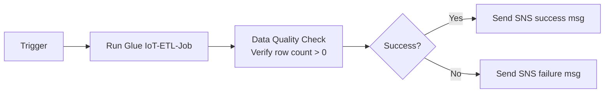

# Pipeline Orchestration
We’ll build an orchestration logic in **Amazon MWAA** (managed Apache Airflow) and **AWS Step Functions**, then monitor both with CloudWatch. This side‑by‑side approach teaches us when to choose a DAG‑based orchestrator vs. a visual, serverless state machine.

We’ll orchestrate the Glue ETL job you built in the **Serverless Data Lake** project (the `IoT-ETL-Job` that transforms IoT data). If you didn’t do that project, I’ll show you how to create a minimal Glue job for testing. The workflow is:



We’ll implement this once in an Airflow DAG and once in a Step Functions state machine.

---

### 🛠️ Prerequisites
- The same AWS account and region you used before (we’ll assume `ap-southeast-2`).
- The Glue job `IoT-ETL-Job` and the S3 bucket `de-project-data-lake-<your-account-id>` with `processedData/` folder (from the Serverless Data Lake project). If that’s gone, recreate the Glue job: a simple Spark job that reads a CSV from S3 and writes Parquet back. I’ll give a minimal version.
- An **SNS topic** for notifications. Let’s create one now and keep its ARN.
- IAM permissions to create MWAA environments, Step Functions state machines, and Lambdas.
- Optionally, the AWS CLI available (or use CloudShell).

> ⚠️ **Cost warning**: MWAA **minimum environment** (mw1.small) costs about **$0.70/hour** (plus $0.15/hour for the NAT gateway). That’s ~$17 for a full day. Tear it down immediately after you finish. Step Functions cost is negligible for a few runs. If you want to avoid MWAA costs, you can still follow the Airflow code logic and run it locally via the Astronomer CLI, but the real MWAA setup is valuable for the exam. I’ll note a cost‑free alternative at the end.

---

### Step 1: Create an SNS topic for notifications

1. Go to **SNS** → **Topics** → **Create topic**.
   - Type: **Standard**
   - Name: `pipeline-notifications`
   - Create topic.
2. Create a subscription to your email:
   - Protocol: **Email**
   - Endpoint: your email address.
   - Confirm the subscription from the email you receive.
3. Copy the **Topic ARN** (`arn:aws:sns:...:pipeline-notifications`).

---

### Step 2: Setup the foundation (S3 artifacts, IAM roles)

#### 2.1 S3 bucket for MWAA DAGs and requirements
MWAA needs a dedicated S3 bucket to store DAG files, plugins, and `requirements.txt`. Use your existing bucket or create a new one (e.g., `de-project-mwaa-<account-id>`). For simplicity, we’ll use the same bucket from earlier: `de-project-data-lake-<account-id>` and create a folder `dags/` at its root.

- In your bucket, create a folder named `dags/`.
- Inside `dags/`, upload the file `requirements.txt` (if you need extra libraries) – we won’t need any beyond boto3, which is pre‑installed.

#### 2.2 IAM role for MWAA
1. IAM → **Roles** → **Create role**  
   - Trusted entity: **AWS service** → **MWAA**.
   - Search for and attach the **`AmazonMWAAFullConsoleAccess`** managed policy (for console access) and **`AmazonS3FullAccess`** (or better, an inline policy scoped to the DAGs bucket). For learning, attach the full access.
2. Add an inline policy to allow MWAA to interact with Glue, SNS, and CloudWatch logs. Use the JSON below, adjusting the resource ARNs if needed (Glue job ARN: `arn:aws:glue:region:account:job/IoT-ETL-Job`; SNS ARN from step 1).
   ```json
   {
       "Version": "2012-10-17",
       "Statement": [
           {
               "Effect": "Allow",
               "Action": [
                   "glue:StartJobRun",
                   "glue:GetJobRun",
                   "glue:GetJobRuns",
                   "glue:BatchStopJobRun"
               ],
               "Resource": "arn:aws:glue:ap-southeast-2:406682760260:job/IoT-ETL-Job"
           },
           {
               "Effect": "Allow",
               "Action": "sns:Publish",
               "Resource": "arn:aws:sns:ap-southeast-2:406682760260:pipeline-notifications"
           },
           {
               "Effect": "Allow",
               "Action": [
                   "logs:CreateLogStream",
                   "logs:CreateLogGroup",
                   "logs:PutLogEvents"
               ],
               "Resource": "arn:aws:logs:*:*:*"
           },
           {
               "Effect": "Allow",
               "Action": [
                   "athena:StartQueryExecution",
                   "athena:GetQueryExecution",
                   "athena:GetQueryResults"
               ],
               "Resource": "*"
           }
       ]
   }
   ```
   Name the inline policy `MWAAOrchestrationPermissions`.
3. Role name: `MWAA-Execution-Role`. Create and copy the ARN.

#### 2.3 IAM role for Step Functions
Create a second role for Step Functions with similar permissions.
- Trusted entity: **Step Functions**.
- Attach the same managed policies (`AWSLambdaFullAccess` maybe) and an inline policy like above, but also allow Lambda invocation if we use a Lambda (we will). For now, attach the policy **`AmazonSNSFullAccess`**, **`AWSGlueConsoleFullAccess`**, and **`AmazonAthenaFullAccess`** (for simplicity). In production, scope down.
- Role name: `StepFunctions-Orchestration-Role`. Copy the ARN.

---

### Step 3: Create the MWAA environment

1. Open the **MWAA Console** → **Create environment**.
2. **Name**: `IoT-Orchestration-Env`.
3. **Airflow version**: choose **2.7.2** or newer (the default).
4. **S3**:
   - DAG code in S3: `s3://<your-bucket>/dags/` (just the folder path, no file).
   - Requirements file: leave blank (we don’t need extra packages).
5. **Networking**:
   - **VPC**: click **Create MWAA VPC**. This will create a VPC named `MWAA-VPC` with public/private subnets and a NAT gateway. (This takes a couple of minutes.)
   - After creation, the console will auto‑select the private subnets and the default security group. You can leave them.
   - **Web server access**: choose **Public network** (so you can open the Airflow UI from your browser). Add your IP or `0.0.0.0/0` for testing.
6. **Environment class**: **mw1.small** (cheapest).
   - Maximum worker count: 2.
   - Minimum worker count: 1.
   - Scheduler count: 1.
7. **Permissions**: choose the **existing IAM role** `MWAA-Execution-Role`.
8. **Encryption and monitoring**: defaults (enable CloudWatch logging at default log group prefix `airflow-IoT-Orchestration-Env-*`).
9. **Create environment**. This will take **20–30 minutes**. Don’t wait – continue with the next steps while it’s being created.

---

### Step 4: Write the Airflow DAG

While MWAA spins up, create the DAG file.

1. Create a file named `iot_orchestration_dag.py` with this content:

```python
from datetime import datetime, timedelta
from airflow import DAG
from airflow.operators.python import PythonOperator
from airflow.providers.amazon.aws.operators.glue import GlueJobOperator
from airflow.providers.amazon.aws.hooks.sns import SnsHook
from airflow.providers.amazon.aws.hooks.athena import AthenaHook
import time

# Default args
default_args = {
    'owner': 'data-engineer',
    'depends_on_past': False,
    'email_on_failure': False,
    'email_on_retry': False,
    'retries': 1,
    'retry_delay': timedelta(minutes=2)
}

# Constants: replace with your actual values
GLUE_JOB_NAME = 'IoT-ETL-Job'
ATHENA_DATABASE = 'iot_database'
ATHENA_TABLE = 'processed_iot_data'   # table name created by Glue job
ATHENA_OUTPUT_S3 = 's3://de-project-data-lake-<account-id>/athena-results/'
SNS_TOPIC_ARN = 'arn:aws:sns:ap-southeast-2:406682760260:pipeline-notifications'

def data_quality_check(**context):
    """Run Athena query to check row count > 0 in processed table."""
    athena_hook = AthenaHook()
    query = f"SELECT COUNT(*) AS cnt FROM {ATHENA_DATABASE}.{ATHENA_TABLE}"
    execution_id = athena_hook.run_query(
        query,
        database=ATHENA_DATABASE,
        output_location=ATHENA_OUTPUT_S3
    )
    # Wait for query to finish
    while True:
        status = athena_hook.get_query_status(execution_id)
        if status in ['SUCCEEDED', 'FAILED', 'CANCELLED']:
            break
        time.sleep(5)
    if status != 'SUCCEEDED':
        raise Exception(f"Data quality query failed: {status}")
    
    # Fetch single result
    result = athena_hook.get_query_results(execution_id)
    rows = result['ResultSet']['Rows'][1:]  # skip header
    if rows:
        count = int(rows[0]['Data'][0]['VarCharValue'])
        if count == 0:
            raise ValueError("Data quality check failed: processed table has 0 rows")
        print(f"Data quality check passed: {count} rows found.")
    else:
        raise ValueError("No rows returned from check query")
    
    return count

def on_success_notification(**context):
    sns_hook = SnsHook()
    sns_hook.publish(
        target_arn=SNS_TOPIC_ARN,
        message="IoT pipeline succeeded: Glue job completed and data quality check passed.",
        subject="Pipeline Success"
    )

def on_failure_notification(context):
    """callback on failure"""
    import airflow.hooks.SnsHook  # needed?
    sns_hook = SnsHook()
    task_instance = context['task_instance']
    sns_hook.publish(
        target_arn=SNS_TOPIC_ARN,
        message=f"Pipeline failed at task: {task_instance.task_id}",
        subject="Pipeline Failure"
    )

with DAG(
    'iot_pipeline_orchestration',
    default_args=default_args,
    description='Orchestrate Glue ETL and data quality check',
    schedule_interval=None,
    start_date=datetime(2024, 1, 1),
    catchup=False,
    tags=['de-exam'],
) as dag:

    run_glue_job = GlueJobOperator(
        task_id='run_iot_etl_job',
        job_name=GLUE_JOB_NAME,
        wait_for_completion=True,
        on_failure_callback=on_failure_notification
    )

    quality_check = PythonOperator(
        task_id='data_quality_check',
        python_callable=data_quality_check,
        on_failure_callback=on_failure_notification
    )

    send_success_sns = PythonOperator(
        task_id='send_success_sns',
        python_callable=on_success_notification,
        trigger_rule='all_success'   # only run if upstream succeeded
    )

    run_glue_job >> quality_check >> send_success_sns
```

2. Adjust the constants:
   - `GLUE_JOB_NAME`: your Glue job name (e.g., `IoT‑ETL‑Job`). If you don’t have it, create a dummy Glue job that runs a 1‑line Spark script: `print("hello")` and succeeds. Then you can skip Athena quality check? No, we need a processed table. Better to still use the existing pipeline. If you don’t have the processed table, you can modify the quality check to count any public dataset.
   - `ATHENA_DATABASE`, `ATHENA_TABLE`, `ATHENA_OUTPUT_S3`: from your earlier project’s processed data. If you don’t have it, you can use `nyc_taxi` data from the data warehousing project (adjust query).
   - `SNS_TOPIC_ARN`: from Step 1.

3. Upload `iot_orchestration_dag.py` to `s3://<your-bucket>/dags/`.  
   MWAA will automatically sync and load the DAG within a few minutes once the environment is ready.

---

### Step 5: Test the MWAA DAG

1. Once the MWAA environment status is **Available**, open the **Airflow UI** by clicking **Open Airflow UI** in the console.  
   You may need to log in with your AWS credentials (or the default admin user created).
2. Unpause the `iot_pipeline_orchestration` DAG (toggle the switch on the left).
3. Click the **Play** button → **Trigger DAG**.
4. Monitor the run. It should turn green and you’ll receive an email via SNS if successful.  
   Check the logs in CloudWatch (`/aws-airflow/IoT-Orchestration-Env/...`) for debugging.

---

### Step 6: Build the equivalent Step Functions workflow

Now replicate the same logic in Step Functions with direct AWS service integrations. We’ll use:
- `Glue: StartJobRun` (with `.sync` integration pattern to wait for completion)
- A **Lambda function** for data quality check (runs Athena query and checks row count)
- `SNS: Publish` for notifications.

#### 6.1 Create Lambda for data quality

1. Go to **Lambda** → **Create function** → **Author from scratch**.
   - Name: `DataQualityCheck`
   - Runtime: Python 3.9 or later.
   - Permissions: choose **Create a new role with basic Lambda permissions**. (We’ll edit it.)
2. After creation, attach a policy for Athena and S3 access.  
   IAM → Roles → the new role → Add permissions → attach policies **`AmazonAthenaFullAccess`** and **`AmazonS3ReadOnlyAccess`** (or more scoped, but fine for learning).
3. In the Lambda code editor, paste the following (adjust database, table, output bucket):

```python
import boto3
import time

def handler(event, context):
    athena = boto3.client('athena')
    database = 'iot_database'           # adjust
    table = 'processed_iot_data'        # adjust
    output_bucket = 's3://de-project-data-lake-406682760260/athena-results/'

    query = f"SELECT COUNT(*) AS cnt FROM {database}.{table}"
    response = athena.start_query_execution(
        QueryString=query,
        QueryExecutionContext={'Database': database},
        ResultConfiguration={'OutputLocation': output_bucket}
    )
    query_execution_id = response['QueryExecutionId']

    # Wait for completion
    while True:
        stats = athena.get_query_execution(QueryExecutionId=query_execution_id)
        status = stats['QueryExecution']['Status']['State']
        if status in ['SUCCEEDED', 'FAILED', 'CANCELLED']:
            break
        time.sleep(2)
    
    if status != 'SUCCEEDED':
        raise Exception(f"Athena query failed: {status}")
    
    # Get result
    result = athena.get_query_results(QueryExecutionId=query_execution_id)
    rows = result['ResultSet']['Rows'][1:]
    if not rows:
        raise ValueError("No rows returned")
    count = int(rows[0]['Data'][0]['VarCharValue'])
    if count == 0:
        raise ValueError("Data quality failed: zero rows")
    
    return {"status": "success", "rowCount": count}
```

4. Deploy the function. Test it manually to be sure.

#### 6.2 Create Step Functions state machine
1. Open **Step Functions** → **Create state machine**.
   - Choose **Write your workflow in code** (Amazon States Language).
   - Type: **Standard**.
2. Paste the following ASL definition. Replace `<Glue-Job-ARN>`, `<SNS-Topic-ARN>`, `<Lambda-Function-ARN>`, and the `Account`/`region` as needed.

```json
{
  "Comment": "Orchestrate Glue ETL and data quality check",
  "StartAt": "Run Glue Job",
  "States": {
    "Run Glue Job": {
      "Type": "Task",
      "Resource": "arn:aws:states:::glue:startJobRun.sync",
      "Parameters": {
        "JobName": "IoT-ETL-Job"
      },
      "Next": "Data Quality Check",
      "Catch": [
        {
          "ErrorEquals": ["States.ALL"],
          "Next": "Send Failure Notification"
        }
      ]
    },
    "Data Quality Check": {
      "Type": "Task",
      "Resource": "arn:aws:states:::lambda:invoke",
      "Parameters": {
        "FunctionName": "arn:aws:lambda:ap-southeast-2:406682760260:function:DataQualityCheck"
      },
      "Next": "Check Quality Result",
      "Catch": [
        {
          "ErrorEquals": ["States.ALL"],
          "Next": "Send Failure Notification"
        }
      ]
    },
    "Check Quality Result": {
      "Type": "Choice",
      "Choices": [
        {
          "Variable": "$.Payload.status",
          "StringEquals": "success",
          "Next": "Send Success Notification"
        }
      ],
      "Default": "Send Failure Notification"
    },
    "Send Success Notification": {
      "Type": "Task",
      "Resource": "arn:aws:states:::sns:publish",
      "Parameters": {
        "TopicArn": "arn:aws:sns:ap-southeast-2:406682760260:pipeline-notifications",
        "Subject": "Pipeline Success",
        "Message": "IoT pipeline succeeded: Glue job and data quality check passed."
      },
      "End": true
    },
    "Send Failure Notification": {
      "Type": "Task",
      "Resource": "arn:aws:states:::sns:publish",
      "Parameters": {
        "TopicArn": "arn:aws:sns:ap-southeast-2:406682760260:pipeline-notifications",
        "Subject": "Pipeline Failed",
        "Message": "IoT pipeline failed. Check Step Functions execution for details."
      },
      "End": true
    }
  }
}
```

3. **Permissions**: select the `StepFunctions-Orchestration-Role` you created earlier (must have permissions for `glue:startJobRun`, `lambda:InvokeFunction`, `sns:Publish`).
4. **Create state machine**. Give it a name `IoT-Pipeline-Orchestration`.

#### 6.3 Execute and compare
1. Start a new execution in Step Functions.
2. You’ll see a visual graph of the state machine as it runs. It will call Glue and wait for completion (via `.sync`), then invoke Lambda, and branch based on result.
3. Check your email for the SNS notification.

---

### Step 7: Monitor with CloudWatch

1. **Airflow logs**: In CloudWatch Logs, find the log group `/aws-airflow/IoT-Orchestration-Env/task/...`. You can create a **CloudWatch Dashboard** and add widgets for the DAG’s success/failure metrics (using Metric Filters).  
   For example, create a metric filter on the Airflow logs that counts occurrences of "Task exited with return code 0" vs. "Task exited with return code 1".
2. **Step Functions metrics**: Step Functions automatically publishes metrics like `ExecutionsStarted`, `ExecutionsSucceeded`, `ExecutionsFailed` to CloudWatch.  
   - Go to CloudWatch → **Metrics** → **AWS/States** → **StateMachineName**.
   - Add a graph widget for `ExecutionsSucceeded` and `ExecutionsFailed` on a dashboard.
3. **Alarms**: Set up a CloudWatch alarm on `ExecutionsFailed >= 1` for the Step Functions state machine, and another on the MWAA metric so you get notified if either pipeline fails silently.

---

### 🧹 Cleanup
- **MWAA**: Delete the environment (this will delete the underlying resources but possibly leave the VPC). Then **delete the MWAA-VPC** manually (NAT gateway, subnets, internet gateway, VPC).
- **Step Functions state machine**: delete it (no cost).
- **Lambda function**: delete `DataQualityCheck`.
- **SNS topic**: delete `pipeline-notifications`.
- **IAM roles**: remove `MWAA-Execution-Role`, `StepFunctions-Orchestration-Role`, and the Lambda’s role if not reused.
- **S3 bucket**: remove the `dags/` folder and perhaps the whole bucket if not needed.

> 💰 To avoid MWAA costs entirely: You can achieve the same orchestration learning by running Airflow locally using the **Astronomer CLI** (`astro dev start`) and executing the same DAG against your AWS account. The Step Functions part still runs in AWS. However, the real MWAA setup gives you the managed service experience, which is valuable for the exam.

---

### 📚 Exam takeaways
- **MWAA**: DAG structure, operators (GlueJobOperator, SnsHook), retry logic, and integration with AWS services. Know that MWAA sits in a VPC and requires proper networking (private subnets, NAT).
- **Step Functions**: `.sync` integration pattern for long-running jobs, direct AWS SDK calls, error handling with `Catch` and `Choice`, and visual monitoring.
- **Orchestration selection**: MWAA for complex pipelines requiring full Python control, custom dependencies, and scheduling; Step Functions for serverless, tight AWS service integration, and low‑code workflows.
- **Monitoring**: CloudWatch logs, metrics, and alarms for both orchestrators — essential for operational support domain.

That’s the full project! Once it runs, you’ll have a real sense for both orchestration styles. Let me know if you run into any blocks.