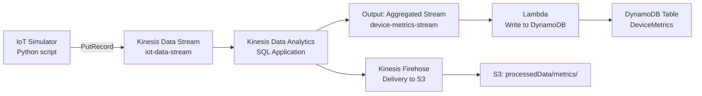

# Real‑Time Metrics with Kinesis Data Analytics (SQL)

Let's build a real‑time streaming analytics pipeline using **Kinesis Data Analytics for SQL**. This project introduces streaming SQL (without the complexity of Flink) and shows how to output results to both a data lake and a live DynamoDB table. It's a perfect two‑star step up from your earlier Kinesis work.

Here's the architecture:



We'll compute a 1‑minute rolling average of temperature and humidity per device, then store both the live results (DynamoDB) and historical archive (S3).

---

### 🛠️ Prerequisites
- The same AWS account and region you've been using.
- The `iot-data-stream` Kinesis stream from the Serverless Data Lake project (or create a new one with on‑demand capacity). We'll reuse the IoT simulator script.
- An S3 bucket for Firehose output (e.g., `de-project-data-lake-<account-id>`).
- IAM permissions for Kinesis Data Analytics, Lambda, DynamoDB, Firehose.

> ⚠️ **Cost warning**: Kinesis Data Analytics for SQL charges per KPU‑hour (~$0.11 per KPU per hour). We'll use 1 KPU (minimum). A few hours of testing costs less than $0.50. Delete the application after use. Kinesis Data Stream (on‑demand) and Firehose are minimal. DynamoDB on‑demand is free for low usage.

---

## Step 1: Prepare the IoT data generator (if not already running)

Reuse the script `iot_simulator.py` from the Data Lake project. It sends records like:

```json
{
    "device_id": "sensor-3",
    "temperature": 23.45,
    "humidity": 55.2,
    "timestamp": "2024-01-15T10:00:00Z"
}
```

Make sure the region matches. Run the script for the duration of the project.

---

## Step 2: Create the DynamoDB table for live metrics

We'll store the latest aggregated metric per device per minute. Use a composite key with `device_id` (PK) and `window_start` (SK). Add a TTL attribute to auto‑expire old data after 24 hours.

1. **DynamoDB → Create table**
   - Table name: `DeviceMetrics`
   - Partition key: `device_id` (String)
   - Sort key: `window_start` (String)
   - Capacity mode: On‑demand

2. After creation, enable TTL:
   - Table → **Additional settings** → **Time to Live (TTL)** → **Manage TTL**.
   - Attribute name: `expire_at` (we'll set this in the Lambda).
   - Enable.

---

## Step 3: Create the Kinesis Data Analytics SQL application

### 3.1 Create the application

1. Open the **Kinesis** console → **Analytics applications** → **SQL applications** → **Create application**.
   - Application name: `device-metrics-analytics`
   - Runtime: **SQL**

2. After creation, click on the application → **Real time analytics** → **Go to SQL editor**.

### 3.2 Connect to the source stream

In the SQL editor, under **Source**, you'll see your input stream. If not already connected:

- Click **Add input** → choose the existing `iot-data-stream`.
- Access permissions: use the default IAM role that Kinesis Analytics creates (or choose an existing role with `kinesis:DescribeStream`, `kinesis:GetRecords`, `kinesis:GetShardIterator`). The wizard will create a role `kinesis-analytics-device-metrics-analytics-<region>`.

Wait for the schema to be discovered. The SQL editor will show columns: `device_id`, `temperature`, `humidity`, `timestamp`.

### 3.3 Define the output streams

We need two destinations:
- **A Kinesis Data Stream** for Lambda → DynamoDB.
- **A Firehose delivery stream** for S3.

**Create the output stream for DynamoDB:**
1. Kinesis Console → **Data Streams** → **Create data stream**.
   - Name: `device-metrics-stream`
   - Capacity: On‑demand.

**Create the Firehose delivery stream for S3:**
1. Kinesis Console → **Delivery streams** → **Create delivery stream**.
   - Source: **Direct PUT** (Kinesis Analytics will PUT to it).
   - Destination: **Amazon S3**
   - Delivery stream name: `device-metrics-firehose`
   - S3 bucket: `de-project-data-lake-<account-id>`, prefix: `processedData/metrics/`
   - Buffer size: 1 MiB, Buffer interval: 60 seconds.
   - IAM role: create/use one with S3 write access.

**Add them as outputs in Kinesis Analytics:**
- In the SQL editor, click **Add output**:
  - **Output 1**: Name `DESTINATION_STREAM`, choose `device-metrics-stream`, format JSON.
  - **Output 2**: Name `DESTINATION_FIREHOSE`, choose `device-metrics-firehose` (from dropdown), format JSON.

### 3.4 Write the real‑time SQL

Paste the following SQL in the editor. It creates two pumps: one for the DynamoDB‑bound stream (latest metric per minute) and one for the Firehose‑bound stream (detailed aggregated records).

```sql
-- Create a stream that aggregates temperature and humidity per device over a 1-minute sliding window
CREATE OR REPLACE STREAM "DEVICE_METRICS" (
    "device_id"         VARCHAR(32),
    "window_start"      TIMESTAMP,
    "avg_temperature"   DOUBLE,
    "avg_humidity"      DOUBLE,
    "record_count"      BIGINT
);

-- Sliding window of 1 minute, advancing by 10 seconds (so updates every 10s)
CREATE OR REPLACE PUMP "STREAM_PUMP" AS
INSERT INTO "DEVICE_METRICS"
SELECT STREAM
    "device_id",
    FLOOR("SOURCE_SQL_STREAM_001"."ROWTIME" TO MINUTE) AS "window_start",
    AVG("temperature") AS "avg_temperature",
    AVG("humidity") AS "avg_humidity",
    COUNT(*) AS "record_count"
FROM "SOURCE_SQL_STREAM_001"
GROUP BY 
    "device_id",
    FLOOR("SOURCE_SQL_STREAM_001"."ROWTIME" TO MINUTE);

-- Output to DynamoDB stream (keep only the latest update per window)
CREATE OR REPLACE PUMP "DYNAMODB_PUMP" AS
INSERT INTO "DESTINATION_STREAM"
SELECT STREAM
    "device_id",
    "window_start",
    "avg_temperature",
    "avg_humidity",
    "record_count"
FROM "DEVICE_METRICS";

-- Output to Firehose (S3) for historical archive
CREATE OR REPLACE PUMP "FIREHOSE_PUMP" AS
INSERT INTO "DESTINATION_FIREHOSE"
SELECT STREAM
    "device_id",
    "window_start",
    "avg_temperature",
    "avg_humidity",
    "record_count"
FROM "DEVICE_METRICS";
```

**Key points:**
- `ROWTIME` is the timestamp when the record was received by the application.
- `FLOOR(... TO MINUTE)` truncates to the start of the minute, giving a grouping key.
- The sliding window is 1 minute wide; the pump fires every time a new record arrives, so the output updates continuously.
- Two pumps push the same aggregated data to two destinations.

Click **Save and run** (the play button). The application will start processing. It may take a few seconds to show sample output.

---

## Step 4: Create the Lambda to write to DynamoDB

We need a Lambda function that reads from `device-metrics-stream`, extracts the aggregated data, and upserts it into DynamoDB.

1. **Lambda → Create function** → Author from scratch.
   - Name: `StoreMetricsToDynamoDB`
   - Runtime: Python 3.9+
   - Permissions: Choose **Create a new role with basic Lambda permissions**.

2. After creation, open the role and attach the following managed policies:
   - `AmazonDynamoDBFullAccess` (or a scoped policy for PutItem on `DeviceMetrics`).
   - `AWSLambdaKinesisExecutionRole` (to read from the Kinesis stream).

3. Paste the function code:

```python
import json
import boto3
import time
from decimal import Decimal

dynamodb = boto3.resource('dynamodb')
table = dynamodb.Table('DeviceMetrics')

def float_to_decimal(obj):
    """Convert float values to Decimal for DynamoDB."""
    if isinstance(obj, float):
        return Decimal(str(obj))
    return obj

def handler(event, context):
    for record in event['Records']:
        # Decode the base64-encoded Kinesis data
        payload = json.loads(record['kinesis']['data'])
        # The Kinesis Analytics output includes all fields
        item = {
            'device_id': payload['device_id'],
            'window_start': payload['window_start'],  # e.g., "2024-01-15 10:00:00.0"
            'avg_temperature': float_to_decimal(payload['avg_temperature']),
            'avg_humidity': float_to_decimal(payload['avg_humidity']),
            'record_count': payload['record_count'],
            # Set TTL to 24 hours from now (in epoch seconds)
            'expire_at': int(time.time()) + 86400
        }
        print(f"Storing item: {item}")
        table.put_item(Item=item)
    return {'statusCode': 200}
```

4. **Deploy** the function.

5. **Add the Kinesis trigger**:
   - In the Lambda console, click **Add trigger**.
   - Source: **Kinesis**
   - Kinesis stream: `device-metrics-stream`
   - Batch size: 10
   - Starting position: Latest
   - Enable.

Now, as soon as the Kinesis Analytics application starts pumping data into `device-metrics-stream`, the Lambda will populate DynamoDB.

---

## Step 5: Test the pipeline

1. **Start the IoT simulator** if not already running.
2. In the Kinesis Analytics SQL editor, you should see the **Real time analytics** tab showing rows flowing through.
3. Wait a minute, then check:
   - **DynamoDB** → **Explore items** → `DeviceMetrics` table. You should see items with `device_id`, `window_start`, average metrics, and `expire_at`.
   - **S3** → `processedData/metrics/` after a minute or two, Firehose delivers Parquet/JSON files (depending on buffer). Download and verify content.
4. **Monitor**: Go to CloudWatch Metrics → **AWS/KinesisAnalytics** → your application. Check `MillisBehindLatest`, `InputBytes`, `OutputRecords`.

---

## 🧹 Cleanup

- **Kinesis Data Analytics application**: Stop and delete the SQL application.
- **Kinesis streams**: Delete `device-metrics-stream` and stop the IoT simulator. Keep `iot-data-stream` if you'll use it for other projects.
- **Firehose delivery stream**: Delete `device-metrics-firehose`.
- **DynamoDB table**: Delete `DeviceMetrics`.
- **Lambda function**: Delete `StoreMetricsToDynamoDB`.
- **S3 output**: Delete the `processedData/metrics/` folder if not needed.
- **IAM roles**: Remove the Kinesis Analytics service role and the Lambda role if you created them specifically.

---

## 📚 What this project teaches for the DEA‑C01 exam

- **Kinesis Data Analytics (SQL)**: Real‑time aggregation using sliding windows, pumps, stream outputs.
- **Streaming SQL syntax**: `CREATE STREAM`, `CREATE PUMP`, `FLOOR`, `AVG`, `COUNT`, and working with `ROWTIME`.
- **Multiple destinations**: Sending the same analytical results to both a low‑latency store (DynamoDB) and an archive (S3 via Firehose).
- **Lambda integration**: Processing Kinesis stream records, handling base64 decoding, and writing to DynamoDB with TTL.
- **Monitoring streaming applications**: Key metrics like `millisBehindLatest`, capacity KPU, input/output record counts.
- **Kinesis Data Analytics vs. Flink**: The exam tests when to use the simpler SQL engine vs. Apache Flink for complex event processing.

You've now built a complete streaming analytics loop—a skill directly applicable to exam scenarios and real‑world data engineering. Let me know if you'd like to move on to another project or need any clarification!