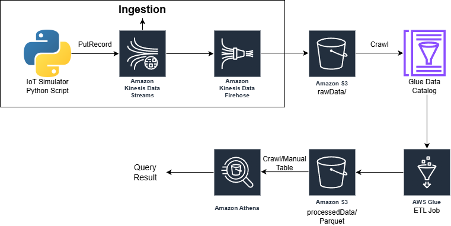

# Serverless Data Lake

This project covers the Data Ingestion & Transformation with Kinesis, Firehose, Glue, S3, and Athena.

Here’s the architecture we’ll implement:


## 🛠️ Prerequisites
* An AWS account with **AdministratorAccess** (for simplicity) or equivalent IAM permissions to create all needed resources.
* **Python 3** installed locally with **boto3** (`pip install boto3`).
* The **AWS CLI** configured with your credentials (`aws configure`).  
  *You can skip the CLI if you prefer using the Console for everything except the Python data generator.*

> ⚠️ Cost notes: A single-shard Kinesis Data Stream and a small Firehose delivery stream incur minimal charges. Glue jobs and Athena scanning also have small costs. Delete all resources after the project to avoid unexpected bills.

---

## Step 1: Create the S3 Data Lake buckets
1. Go to the [S3 Console](https://s3.console.aws.amazon.com/s3/).
2. Click **Create bucket**.
   * Bucket name: `de-project-data-lake-<your-account-id>` (must be unique).
   * Region: same as where you will run other services (e.g., `us-east-1`).
   * Leave all other settings default, **enable bucket versioning** only if you want (not required). This is to keep the versions of your objects.
   * Click **Create bucket**.
3. Inside the bucket, click **Create folder**.
   * Create a folder named `rawData/`.
   * Create another folder named `processedData/`.

---

## Step 2: Create IAM roles for Glue and Firehose
We need two roles:
* **Glue service role**: allows Glue to access S3 and CloudWatch logs.
* **Firehose role**: allows Firehose to read from Kinesis Stream and write to S3.

### Glue Role
1. Go to the [IAM Console](https://console.aws.amazon.com/iam/).
2. **Roles** → **Create role**.
   * Trusted entity: **AWS service**, select **Glue** → Next.
   * Search for and attach the managed policy `AWSGlueServiceRole`→ Next.
   * Name the role `GlueServiceRoleDE` → Create Role.
3. Add an inline policy to grant access to your S3 bucket.
   * After role creation, open the role, go to **Permissions** tab → **Add Permissions** → **Create inline policy** → in the **Policy Editor** choose **JSON**.
   * Paste the following, replacing `de-project-data-lake-<your-account-id>` with your actual bucket name:
     ```json
     {
         "Version": "2012-10-17",
         "Statement": [
             {
                 "Effect": "Allow",
                 "Action": [
                     "s3:GetObject",
                     "s3:PutObject",
                     "s3:DeleteObject"
                 ],
                 "Resource": "arn:aws:s3:::de-project-data-lake-<your-account-id>/*"
             },
             {
                 "Effect": "Allow",
                 "Action": "s3:ListBucket",
                 "Resource": "arn:aws:s3:::de-project-data-lake-<your-account-id>"
             }
         ]
     }
     ```
   * Click **Next** → Name the inline policy `S3AccessForGlue` → **Create policy**.

### Firehose Role
1. **Roles** → **Create role**.
   * Trusted entity: **AWS service**, select **Firehose** then → Next.
   * Name the role `FirehoseRoleDE`.
2. Attach the managed policy `AmazonKinesisFirehoseFullAccess`
3. Add an inline policy for S3 write access (similar to above but limited to the `rawData/` prefix). Paste this JSON (adjust bucket name):
   ```json
   {
       "Version": "2012-10-17",
       "Statement": [
           {
               "Effect": "Allow",
               "Action": [
                   "s3:PutObject",
                   "s3:PutObjectAcl"
               ],
               "Resource": "arn:aws:s3:::de-project-data-lake-<your-account-id>/rawData/*"
           },
           {
               "Effect": "Allow",
               "Action": "s3:ListBucket",
               "Resource": "arn:aws:s3:::de-project-data-lake-<your-account-id>"
           }
       ]
   }
   ```
   Name it `FirehoseS3Access` → **Create policy**.

---

## Step 3: Create the Kinesis Data Stream
1. Open the [Kinesis Console](https://console.aws.amazon.com/kinesis/).
2. Click **Create data stream**.
   * Data stream name: `iot-data-stream`.
   * Capacity mode: **On‑demand** (no need to manage shards) – if you prefer, use Provisioned with 1 shard (Free Tier for 1 shard for 30 days).
   * Leave other defaults → **Create data stream**.
3. Wait for it to become **Active**.
4. Add another inline policy to the FirehoseRoleDE role to allow Kinesis actions to read from your data stream. The managed policy `AmazonKinesisFirehoseFullAccess` only grants management access to Firehose itself, not to the underlying Kinesis Data Stream.
    ```json
   {
    "Version": "2012-10-17",
    "Statement": [
        {
            "Effect": "Allow",
            "Action": [
                "kinesis:DescribeStream",
                "kinesis:DescribeStreamSummary",
                "kinesis:GetRecords",
                "kinesis:GetShardIterator",
                "kinesis:ListShards",
                "kinesis:SubscribeToShard"
            ],
            "Resource": "arn:aws:kinesis:ap-southeast-2:406682760260:stream/iot-data-stream"
        }
    ]
    }
   ```
    Replace the stream ARN with **your real stream’s ARN** (copy it from the Kinesis stream details page).

---

### Step 4: Create the Kinesis Data Firehose delivery stream
1. In the Kinesis console, go to **Amazon Data Firehose** → **Create Firehose stream**.
   * Source: **Kinesis Data Stream**
   * Destination: **Amazon S3**
2. **Firehose stream name**: `IoT-S3-Delivery`.
2. **Source settings**
   * Kinesis data stream: `iot-data-stream`.
4. **Transform and convert records** – leave default (no transformation).
5. **Destination settings**
   * S3 bucket: `de-project-data-lake-<your-account-id>`.
   * Dynamic partitioning: leave off.
   * S3 prefix: `rawData/` (this ensures all files land in the folder).
   * Error prefix: `rawData/errors/` (can leave blank).
6. **Buffer hints**
   * Buffer size: 1 MiB, Buffer interval: 60 seconds (the smallest values; this causes Firehose to flush quickly so you can see data during testing).
7. Open Advanced Settings → **Service access**
   * Choose **Choose existing IAM role** and select `FirehoseRoleDE`.
8. Review and **Create Firehose Stream**.
9. Wait for the delivery stream to become **Active**.

---

### Step 5: Generate and send sample IoT data
We’ll use a Python script that simulates device data (temperature, humidity, timestamp) and pushes it to the Kinesis stream every second. Firehose will then deliver it to S3.

Save the following script as `iot_simulator.py` (replace `<stream-name>` and `<region>` if different):
```python
import boto3
import json
import time
import random
from datetime import datetime, timezone

kinesis = boto3.client('kinesis', region_name='ap-southeast-2')

STREAM_NAME = "iot-data-streams"

while True:
    record = {
        'device_id': f'sensor-{random.randint(1, 10)}',
        'temperature': round(random.uniform(20.0, 30.0), 2),
        'humidity': round(random.uniform(40.0, 70.0), 2),
        'timestamp': datetime.now(timezone.utc).isoformat()
    }
    try:
        response = kinesis.put_record(
            StreamName = STREAM_NAME,
            Data=json.dumps(record),
            PartitionKey=str(record['device_id'])
        )
        print(f"Sent: {record} - ShardId: {response['ShardId']}")
    except Exception as e:
        print(f"Error: {e}")
    time.sleep(1)  # send one record per second
```

Run the script for **5–10 minutes** to accumulate enough data:
```bash
python iot_simulator.py
```
Press Ctrl+C to stop.

---

### Step 6: Verify raw data in S3
1. After a minute or two from the time you started the script, go to your S3 bucket → `rawData/`.
2. You should see one or more objects with names like `2024/01/01/12/...` (Firehose partitions by date by default).  
   Download and open a file – it contains a base64‑encoded JSON record per line (or raw JSON depending on Firehose’s encoding; it’s fine).

> ℹ️ If you see a `.processing` folder, wait a bit for the buffer to flush.

---

### Step 7: Crawl the raw data with AWS Glue
1. Go to the [AWS Glue Console](https://console.aws.amazon.com/glue/) → **Crawlers** → **Create  crawler**.
   * Crawler name: `RawIoTDataCrawler`.
2. **Crawler source type**: Data stores.
3. **Add a data store**:
   * Choose **S3**, include path: `s3://de-project-data-lake-<your-account-id>/rawData/`.
   * Choose “Sample only a subset of files” and fill 10 Files (just to make the crawling quicker).
4. **IAM role**: choose existing role `GlueServiceRoleDE`.
5. **Target database**: click **Add database**, name it `iot_database`, then select it after creation.
   * Table name prefix: `raw_`.
6. **Crawler Scheduler**: On demand.
8. Review and **Finish** → **Run crawler**.

When the crawler finishes, it creates a table in the Glue Data Catalog (likely named `raw_iot_data_stream` or similar, depending on the path). You can view it in **Glue → Databases → iot_database → Tables**.

---

### Step 8: (Optional) Preview raw table in Athena
1. Open the [Athena Console](https://console.aws.amazon.com/athena/).
2. Before first query, confirm that a primary workgroup exists (use `primary`) and that you have set a query result location (e.g., `s3://de-project-data-lake-<your-account-id>/athena-results/`). If not, click **Settings** → **Manage** to set it.
3. In the query editor, select the `iot_database` and run:
   ```sql
   SELECT * FROM "iot_database"."raw_..." LIMIT 10;
   ```
4. You should see records with columns like `device_id`, `temperature`, `humidity`, `timestamp` (the Glue Crawler inferred them from the JSON schema).

---

### Step 9: Build the Glue ETL job to transform data
We’ll use **Glue Studio** to create a visual ETL job.

1. In Glue Console, go to **Visual ETL** → **Create job** → **Visual ETL**.
2. Under **Sources**, click **S3**.
   * Name: `Raw IoT Data`
   * S3 source type: **Data Catalog table**
   * Database: `iot_database`
   * Table: the raw table you created (e.g., `raw_iot_data_stream`).
3. Under **Transforms**, double‑click **Change Schema**.
   * Connect it to the source node.
   * In the node details, drop any columns you don’t need (e.g., `timestamp` might be duplicated if Firehose adds its own). Keep at least `device_id`, `temperature`, `humidity`, `timestamp`.
4. Make sure `temperature` and `humidity` data type is set to `double`.
5. Under **Targets**, double‑click **S3**.
   * Node name: `Processed IoT Data`
   * Format: **Parquet**
   * Compression: **Snappy**
   * S3 Target Location: `s3://de-project-data-lake-<your-account-id>/processedData/`
   * Data Catalog update options: **Create a table in the Data Catalog and on subsequent runs, update the schema and add new partitions**.
     * Database: `iot_database`
     * Table name: `processed_iot_data`
     * Partition keys: `device_id` (optional – split data by device to practice partitioning) or nothing. For simplicity, you can skip partitioning.
   * Connection: connect the Transform node to this target.
6. **Job details** tab:
   * Name: `IoT-ETL-Job`
   * IAM Role: `GlueServiceRoleDE`
   * Type: **Spark**
   * Glue version: **Glue 5.1**
   * Job bookmark: **Enable** (so subsequent runs process only new data).
7. **Save** the job and then click **Run**.  
   Wait for the job to succeed.

---

### Step 10: Query transformed data in Athena
1. Open Athena console. You should already see the `processed_iot_data` table in `iot_database` (created by the ETL job). If not, manually add the table using the Glue Crawler (run it on `s3://.../processedData/`).
2. Run:
   ```sql
   SELECT device_id, AVG(temperature) as avg_temp, MAX(humidity) as max_humidity
   FROM processed_iot_data
   GROUP BY device_id;
   ```
3. Note how Parquet columnar storage makes scans fast and cost‑effective – a key concept for the exam.

---

## 🧹 Clean Up Resources
Delete everything that’s no longer needed to avoid costs:
- **S3**: empty the bucket (delete the `rawData/`, `processedData/`, `athena-results/` folders), then delete the bucket.
- **Kinesis Data Stream** `iot-data-stream`: Delete.
- **Kinesis Data Firehose** `IoT-S3-Delivery`: Delete.
- **Glue Crawler** `RawIoTDataCrawler`: Delete.
- **Glue ETL Job** `IoT-ETL-Job`: Delete (or just stop).
- **Glue Data Catalog objects**: In the Glue Console → Databases, delete the `iot_database` (this removes the tables and preferences).
- **Athena workgroup**: if you created a custom one, delete it. The primary workgroup can stay (it costs nothing without queries).
- **IAM roles**: Delete `GlueServiceRoleDE` and `FirehoseRoleDE`.

---

## 📚 What this project about
* **Data Ingestion**: Real‑time streaming with Kinesis, Firehose delivery to S3.
* **Data Cataloging**: How Glue Crawlers automatically infer schema and populate the Data Catalog.
* **ETL**: Designing a Glue job with source, transformations, and target; using Parquet for optimization.
* **Querying**: Athena serverless SQL directly on S3 data.
* **IAM least privilege**: Creating roles with only the required permissions for Glue and Firehose.
* **File formats & compression**: Parquet with Snappy, columnar benefits, cost savings.