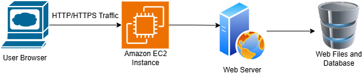

# Full-Stack Web Application on AWS EC2

A production-ready deployment of a full-stack web application built with React, TypeScript, Node.js, Express, and SQLite, hosted on an Amazon EC2 instance.

## 🏗️ Project Architecture

This project utilizes a classic three-tier architecture deployed on a single Amazon EC2 instance for simplicity and cost-effectiveness.



## 🏗 Key Components
* **Frontend:** React application with TypeScript, built into static files
* **Backend:** Node.js/Express server providing RESTful API endpoints
* **Database:** SQLite for data persistence (file-based)
* **Web Server:** NGINX as reverse proxy and static file server
* **Process Manager:** PM2 for keeping Node.js application running
* **Infrastructure:** AWS EC2 t4g.small instance (ARM-based Graviton2)

## ✨ Features
* **Full-Stack TypeScript:** Type safety across both frontend and backend
* **Dynamic IP Handling:** Automatic public IP configuration on instance restart
* **Production-Ready Setup:** NGINX configuration, process management, and logging
* **Cost-Optimized:** Uses AWS Graviton-based instance for better price-performance
* **Simple Deployment:** Scripted setup and configuration process

## 🚀 Deployment Guide

### Prerequisites
- AWS Account with EC2 access
- EC2 key pair for SSH access
- Node.js 18+ and npm installed locally
- Git for version control

### Step 1: Launch EC2 Instance

1. **Navigate to EC2 Console**: Go to AWS Management Console > EC2
2. **Launch Instance**:
   - AMI: Amazon Linux 2023 (ARM64 for t4g instances)
   - Instance Type: `t4g.small` (2 vCPU, 2 GiB RAM)
   - Key Pair: Select or create a new key pair
   - Security Group: Configure to allow:
      - SSH (Port 22) from your IP
      - HTTP (Port 80) from anywhere
      - HTTPS (Port 443) from anywhere (if using SSL)
   - Storage: 8-20 GB GP3 volume

3. **Connect to Instance**:
```bash
ssh -i "your-key.pem" ec2-user@your-instance-public-ip
```

### Step 2: Server Setup
Run these commands on your EC2 instance:
```bash
# Update system and install dependencies
sudo dnf update -y
sudo dnf install -y nodejs npm nginx git

# Install PM2 process manager globally
sudo npm install -g pm2

# Clone your repository
cd /home/ec2-user
git clone your_github_url app
cd app

# Install backend dependencies
npm install

# Install frontend dependencies and build
cd client
npm install
npm run build
cd ..
mv client/build client-build
```

### Step 3: Configure SQLite Database

```bash
# Create data directory and initialize database
mkdir -p /home/ec2-user/app/data

# Run database migrations (if you have any)
npm run migrate
```

### Step 4: Configure NGINX

Edit the NGINX configuration:

```bash
sudo nano /etc/nginx/nginx.conf
```

Add this server block:
```nginx
server {
    listen 80;
    server_name _; # Listen on all domains/IPs
    
    # Serve React static files
    location / {
        root /home/ec2-user/app/client-build;
        index index.html;
        try_files $uri $uri/ /index.html;
    }
    
    # Proxy API requests to Node.js
    location /api {
        proxy_pass http://localhost:5000;
        proxy_http_version 1.1;
        proxy_set_header Upgrade $http_upgrade;
        proxy_set_header Connection 'upgrade';
        proxy_set_header Host $host;
        proxy_set_header X-Real-IP $remote_addr;
        proxy_set_header X-Forwarded-For $proxy_add_x_forwarded_for;
        proxy_set_header X-Forwarded-Proto $scheme;
        proxy_cache_bypass $http_upgrade;
    }
    
    # Serve static assets directly
    location /static/ {
        root /home/ec2-user/app/client-build;
        expires 1y;
        add_header Cache-Control "public, immutable";
    }
}
```

Test and restart NGINX:
```bash
sudo nginx -t
sudo systemctl restart nginx
sudo systemctl enable nginx
```

### Step 5: Set Up Dynamic IP Configuration
Create the IP update script:

```bash
sudo nano /usr/local/bin/update-instance-ip.sh
```

Paste the script from the implementation section. Then:

```bash
# Make script executable
sudo chmod +x /usr/local/bin/update-instance-ip.sh

# Create systemd service
sudo nano /etc/systemd/system/update-instance-ip.service
```

Add the service configuration, enable and start it:

```bash
sudo systemctl daemon-reload
sudo systemctl enable update-instance-ip.service
sudo systemctl start update-instance-ip.service
```

### Step 6: Start the Application

```bash
# Navigate to app directory
cd /home/ec2-user/app

# Start the Node.js application with PM2
pm2 start dist/server.js --name "your-app"

# Save PM2 process list
pm2 save

# Set up PM2 to start on boot
pm2 startup
```

## ⚙️ Dynamic IP Configuration System
### How It Works
The dynamic IP system automatically handles public IP changes when the EC2 instance is stopped and restarted:

1. **Boot Script**: `update-instance-ip.sh` runs on system startup
2. **IP Discovery**: Fetches current public IP from AWS metadata service
3. **Configuration Update**: Updates any configuration files that reference the IP
4. **Service Reload**: Restarts NGINX and application services as needed

### Script Details
The main script (`/usr/local/bin/update-instance-ip.sh`):

```bash
#!/bin/bash
# Fetches the current public IP and updates configurations

#Get the IMDSv2 Token (Required for Amazon Linux 2023)
TOKEN=$(curl -X PUT "http://169.254.169.254/latest/api/token" -H "X-aws-ec2-metadata-token-ttl-seconds: 21600")

# Use the Token to get the Public IP
NEW_PUBLIC_IP=$(curl -H "X-aws-ec2-metadata-token: $TOKEN" -s http://169.254.169.254/latest/meta-data/public-ipv4)
echo "$(date): Instance IP updated to $NEW_PUBLIC_IP" >> /var/log/ip-update.log

# Update any configuration files here
# Example: sed -i "s/old-ip/$NEW_PUBLIC_IP/g" /path/to/config

# Restart services if needed
sudo systemctl reload nginx
```

## 💰 Cost Optimization Tips
1. **Use Free Trial**: The t4g.small qualifies for 750 free hours/month until 2026
2. **Stop When Not in Use**: Stop the instance during development breaks
3. **Monitor Usage**: Use AWS Cost Explorer to track spending

## 🔧 Maintenance & Operations
### Common Commands

```bash
# View application logs
pm2 logs your-app

# View NGINX logs
sudo tail -f /var/log/nginx/access.log
sudo tail -f /var/log/nginx/error.log

# Restart services
pm2 restart media-tracker
sudo systemctl restart nginx

# Check instance status
sudo systemctl status nginx
pm2 status
```

### Backup Database
```bash
# Create backup
cp /home/ec2-user/app/data/database.sqlite \
   /home/ec2-user/app/data/database.backup.$(date +%Y%m%d).sqlite

# Restore from backup
cp /home/ec2-user/app/data/database.backup.sqlite \
   /home/ec2-user/app/data/database.sqlite
```

## 🐛 Troubleshooting
### Common Issues and Solutions
| Issue | Possible Cause | Solution |
| :--- | :--- | :--- |
| **"Connection refused"** | Node.js app not running | `pm2 start your-app` |
| **"502 Bad Gateway"** | NGINX can't reach backend | Check if app is running on port 5000 |
| **Static files not loading** | Incorrect NGINX root path | Verify `root` directive in NGINX config |
| **Database errors** | Permission issues | `chmod 755 /home/ec2-user/app/data` |
| **IP not updating** | Script not executable | `chmod +x /usr/local/bin/update-instance-ip.sh` |

### Log Locations
- **Application Logs**: `pm2 logs media-tracker`
- **NGINX Access Log**: `/var/log/nginx/access.log`
- **NGINX Error Log**: `/var/log/nginx/error.log`
- **IP Update Log**: `/var/log/ip-update.log`
- **System Logs**: `journalctl -u update-instance-ip.service`

## 🧹 Cleanup Instructions
To avoid unnecessary AWS charges:

**1. On EC2 instance**
```bash
pm2 delete your-app
pm2 save
```

**2. In AWS Console**
1. Terminate EC2 instance
2. Release any Elastic IPs (if used)
3. Delete security groups created for this project
4. Remove any snapshots or AMIs