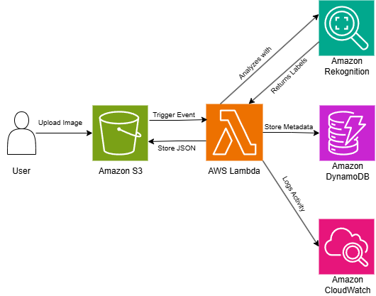

# AWS Serverless Image Recognition Engine

A scalable, serverless system that automatically analyzes uploaded images to detect objects, scenes, and labels using Amazon Rekognition.

## 📋 Project Overview

This project implements a fully automated image recognition pipeline on AWS. Users upload images, which triggers a serverless workflow that analyzes the content using AI and stores the results for further use. The system is built with cost-efficiency and scalability in mind, leveraging AWS's pay-per-use services.

### Core Features
- **Automated Processing**: Instant analysis upon image upload.
- **High Accuracy**: Leverages Amazon Rekognition's state-of-the-art computer vision.
- **Scalable & Serverless**: No infrastructure to manage; scales automatically with usage.
- **Dual Storage**: Stores both raw JSON results and searchable metadata.
- **Secure Upload**: Provides secure, temporary URLs for client-side uploads.

## 🏗️ System Architecture



## 🚀 Deployment Guide
### Phase 1: Foundational Setup
1. **Create Source S3 Bucket**
2. **Create Destination S3 Bucket & DynamoDB Table**
3. **Create IAM Execution Role for Lambda**
    - Navigate to **IAM > Roles > Create role**.
    - Select **AWS service > Lambda** as the trusted entity.
    - Attach the following managed policies:
        - `AWSLambdaBasicExecutionRole`
        - `AmazonS3ReadOnlyAccess`
        - `AmazonRekognitionReadOnlyAccess`
    - Name the role: `lambda-rekognition-execution-role`.
    - Attach an inline policy
    ```json
    {
        "Version": "2012-10-17",
        "Statement": [
            {
                "Effect": "Allow",
                "Action": ["s3:PutObject"],
                "Resource": "arn:aws:s3:::your-unique-results-bucket-name/*"
            },
            {
                "Effect": "Allow",
                "Action": ["dynamodb:PutItem"],
                "Resource": "arn:aws:dynamodb:us-east-1:123456789012:table/ImageRecognitionMetadata"
            }
        ]
    }
    ```
4. **Create the Main Lambda Function**
    - Go to **Lambda > Create function** (Author from scratch).
    - Name: `image-recognition-main`.
    - Runtime: `Python 3.10`.
    - Architecture: `x86_64`.
    - Permissions: Use the existing `lambda-rekognition-execution-role`.
    - Use the Lambda code:
    ```python
    import json, boto3, logging
    from datetime import datetime
    from decimal import Decimal

    logger = logging.getLogger()
    logger.setLevel(logging.INFO)

    s3 = boto3.client('s3')
    rekognition = boto3.client('rekognition')
    dynamodb = boto3.resource('dynamodb')
    table = dynamodb.Table('ImageRecognitionMetadata')

    DESTINATION_BUCKET = 'your-unique-results-bucket-name'  # Set as Env Var

    def lambda_handler(event, context):
        try:
            source_bucket = event['Records'][0]['s3']['bucket']['name']
            image_key = event['Records'][0]['s3']['object']['key']
            
            # Analyze image with Rekognition
            rek_response = rekognition.detect_labels(
                Image={'S3Object': {'Bucket': source_bucket, 'Name': image_key}},
                MaxLabels=15,
                MinConfidence=70
            )
            
            labels = [
                {'Label': label['Name'], 'Confidence': Decimal(str(label['Confidence']))}
                for label in rek_response['Labels']
            ]
            
            # Prepare result object
            result = {
                'image_id': image_key,
                'processed_time': datetime.utcnow().isoformat(),
                'source_bucket': source_bucket,
                'labels': labels
            }
            
            # Save full result to S3
            result_key = f"results/{image_key}/{datetime.utcnow().timestamp()}.json"
            s3.put_object(
                Bucket=DESTINATION_BUCKET,
                Key=result_key,
                Body=json.dumps(result, default=str),
                ContentType='application/json'
            )
            
            # Store metadata in DynamoDB
            table.put_item(Item={
                'ImageID': image_key,
                'ProcessTimestamp': result['processed_time'],
                'LabelCount': len(labels),
                'TopLabels': [label['Label'] for label in sorted(labels, key=lambda x: x['Confidence'], reverse=True)[:3]],
                'ResultLocation': f's3://{DESTINATION_BUCKET}/{result_key}'
            })
            
            return {'statusCode': 200, 'body': json.dumps('Processing complete')}
            
        except Exception as e:
            logger.error(f"Error: {str(e)}")
            raise
    ```
    - Set timeout to 1 minute.

5. **Configure the S3 Trigger**
    - In the Lambda function console, go to **Configuration > Triggers > Add trigger**.
    - Select **S3**.
    - Choose your source bucket.
    - Event type: `All object create events`.
    - Add the trigger.

### Phase 2: Enhancements Setup

1. **Create API Gateway & Upload Lambda**
    - Create a new Lambda function `api-image-upload` with this code:
    ```python
    import json, boto3, os, uuid

    s3 = boto3.client('s3')
    SOURCE_BUCKET = os.environ['SOURCE_BUCKET_NAME']

    def lambda_handler(event, context):
        file_extension = 'jpg'  # Can be dynamic based on request
        file_key = f"uploads/{uuid.uuid4()}.{file_extension}"
        
        presigned_url = s3.generate_presigned_url(
            'put_object',
            Params={
                'Bucket': SOURCE_BUCKET,
                'Key': file_key,
                'ContentType': f'image/{file_extension}'
            },
            ExpiresIn=300  # 5 minutes
        )
        
        return {
            'statusCode': 200,
            'headers': {'Access-Control-Allow-Origin': '*'},
            'body': json.dumps({
                'uploadUrl': presigned_url,
                'fileKey': file_key
            })
        }
    ```
    - Create a REST API in **API Gateway** with a `POST /upload` method integrated with the `api-image-upload` Lambda.
    - Enable CORS and deploy the API.
    - Set the `SOURCE_BUCKET_NAME` environment variable in the upload Lambda.

2. **Create an SQS Queue for Errors**
    - In SQS, create a standard queue named `image-recognition-dlq`.
    - Configure the main Lambda's **Asynchronous invocation** settings to use this queue as its **Dead-letter queue**.

3. **Set Up CloudWatch Dashboard**
    - In CloudWatch, create a dashboard named `ImageRecognition-Dashboard`.
    - Add widgets for:
        - Lambda Invocations & Errors
        - Rekognition `SuccessfulRequestCount`
        - S3 Object Count

## 🔧 Testing the System
### Test via API (Recommended)
```bash
# 1. Get a pre-signed upload URL
curl -X POST https://your-api-id.execute-api.region.amazonaws.com/prod/upload

# 2. Upload an image directly using the returned URL
curl -X PUT -H "Content-Type: image/jpeg" --upload-file "./test-image.jpg" "<presigned-url>"
```

### Test via AWS Console
1. Navigate to your **Source S3 Bucket** in the AWS Console.
2. Click **Upload** and select a test image (JPG/PNG).
3. Within seconds:
    - Check **CloudWatch Logs** for the main Lambda function.
    - Check the **Destination S3 Bucket** for the result JSON.
    - Check the **DynamoDB** table for the metadata item.

## 📊 Monitoring & Operations
### CloudWatch Dashboard
Access the `ImageRecognition-Dashboard` in CloudWatch to monitor:
- **Throughput**: Number of images processed per minute.
- **Performance**: Lambda duration and Rekognition latency.
- **Errors**: Lambda failures and DLQ message count.
- **Data Volume**: S3 object counts and DynamoDB item counts.

### Common Metrics & Alarms
Set up alarms for:
- `Lambda Errors > 0` for 5 minutes
- `Rekognition UserErrorCount > 5` in 1 minute
- `S3 Bucket Size > 10 GB` (if applicable)