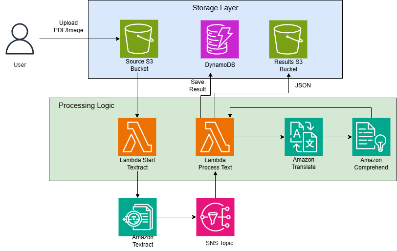

# Intelligent Document Processor - AWS Serverless Pipeline

## 📋 Project Overview
A serverless pipeline that automatically processes uploaded documents to extract text, translate content, and perform sentiment analysis using AWS AI services.

### **System Architecture**


## 🚀 Implementation Guide
### Phase 1: Foundation Setup
1. **Create S3 Buckets**, source bucker for document uploads and results buckets for A2I outputs
2. **Configure S3 CORS Policy (Required for A2I)**. Via Console: **S3 Bucket → Permissions → CORS configuration**. Add to your source bucket CORS configuration:

```json
[
  {
    "AllowedHeaders": [],
    "AllowedMethods": ["GET"],
    "AllowedOrigins": ["*"],
    "ExposeHeaders": []
  }
]
```

3. **Create DynamoDB table**
4. **Create SNS Topic and SQS DLQ**

### Phase 2: IAM Configuration
1.  **Create IAM Role for Lambda Functions**. Create role `ProcessTextAndAnalyze` with trust relationship:

```json
{
  "Version": "2012-10-17",
  "Statement": [
    {
      "Effect": "Allow",
      "Principal": {
        "Service": [
          "lambda.amazonaws.com",
          "sagemaker.amazonaws.com"
        ]
      },
      "Action": "sts:AssumeRole"
    }
  ]
}
```
2. **Attach Required Policies**. Attach these managed policies to the role:
- `AWSLambdaBasicExecutionRole`
- `AmazonS3ReadOnlyAccess`
- `AmazonTextractFullAccess`
- `AmazonTranslateFullAccess`
- `AmazonComprehendFullAccess`
- `AmazonAugmentedAIIntegratedAPIAccess`
- `AmazonSNSFullAccess`

3. **Add Custom Inline Policies**. S3 Write Access for A2I Outputs:
```json
{
    "Version": "2012-10-17",
    "Statement": [
        {
            "Sid": "AllowA2IWriteToOutput",
            "Effect": "Allow",
            "Action": ["s3:PutObject"],
            "Resource": "arn:aws:s3:::your-a2i-results-bucket/*"
        }
    ]
}
```

SQS SendMessage for DLQ:

```json
{
    "Version": "2012-10-17",
    "Statement": [
        {
            "Sid": "AllowSQSSendToDLQ",
            "Effect": "Allow",
            "Action": "sqs:SendMessage",
            "Resource": "arn:aws:sqs:REGION:ACCOUNT_ID:TextractSNS-DeadLetterQueue"
        }
    ]
}
```

### Phase 3: Lambda Function Implementation
1. **StartTextractJob Lambda**. Trigger: S3 PutObject event on source bucket. Environment Variables:
- `SNS_TOPIC_ARN`: Your SNS topic ARN
- `A2I_FLOW_DEFINITION_ARN`: A2I workflow ARN (if using human review)
- `A2I_OUTPUT_BUCKET`: S3 bucket for A2I results

    Code Snippet - Key Configuration:
```python
response = textract.start_document_analysis(
    DocumentLocation={'S3Object': {'Bucket': bucket, 'Name': document}},
    FeatureTypes=['TABLES', 'FORMS'],  # Extract structured data
    NotificationChannel={
        'SNSTopicArn': os.environ['SNS_TOPIC_ARN'],
        'RoleArn': 'ROLE_FOR_SNS_PUBLISH'
    },
    HumanLoopConfig={
        'HumanLoopName': f'review-loop-{context.aws_request_id}',
        'FlowDefinitionArn': os.environ['A2I_FLOW_DEFINITION_ARN'],
        'DataAttributes': {
            'ContentClassifiers': ['FreeOfPersonallyIdentifiableInformation']
        }
    } if os.environ.get('A2I_FLOW_DEFINITION_ARN') else {}
)
```

2. **ProcessTextAndAnalyze Lambda**. Trigger: SNS Topic subscription. Environment Variables:
- `DYNAMODB_TABLE`: `DocumentProcessingResults`
- `SQS_DLQ_URL`: Your SQS DLQ URL
- `A2I_FLOW_DEFINITION_ARN`: A2I workflow ARN
- `TRANSLATE_TARGET_LANG`: Target language code (e.g., 'id')

    Key Features Implemented:
- Retry logic with exponential backoff (3 attempts)
- Structured data extraction (forms and tables)
- Human review loop integration
- Comprehensive error handling with DLQ fallback

    Full Code:

```python
import json
import os
import time
import boto3
from decimal import Decimal
from datetime import datetime

# ============================================================================
# INITIALIZATION
# ============================================================================
# Initialize AWS service clients
textract = boto3.client('textract')
translate = boto3.client('translate')
comprehend = boto3.client('comprehend')
dynamodb = boto3.resource('dynamodb')
sqs = boto3.client('sqs')
a2i_runtime = boto3.client('sagemaker-a2i-runtime')

# Configuration from environment variables
DYNAMODB_TABLE_NAME = os.environ.get('DYNAMODB_TABLE', 'DocumentProcessingResults')
SQS_DLQ_URL = os.environ.get('SQS_DLQ_URL')
A2I_FLOW_DEFINITION_ARN = os.environ.get('A2I_FLOW_DEFINITION_ARN')
A2I_OUTPUT_BUCKET = os.environ.get('A2I_OUTPUT_BUCKET')
TRANSLATE_TARGET_LANG = os.environ.get('TRANSLATE_TARGET_LANG', 'id')

# Initialize DynamoDB table
results_table = dynamodb.Table(DYNAMODB_TABLE_NAME)

# ============================================================================
# TEXT EXTRACTION HELPER FUNCTIONS
# ============================================================================

def extract_text_and_structured_data(job_id):
    """
    Extract text, forms, and tables from Textract results with pagination
    """
    blocks = []
    next_token = None
    
    # Get all blocks with pagination
    while True:
        if next_token:
            response = textract.get_document_analysis(
                JobId=job_id,
                NextToken=next_token
            )
        else:
            response = textract.get_document_analysis(JobId=job_id)
        
        blocks.extend(response.get('Blocks', []))
        next_token = response.get('NextToken')
        if not next_token:
            break
    
    # Process blocks
    raw_text = extract_lines_from_blocks(blocks)
    forms_data = extract_forms_from_blocks(blocks)
    tables_data = extract_tables_from_blocks(blocks)
    
    return {
        'raw_text': raw_text,
        'forms_data': forms_data,
        'tables_data': tables_data,
        'blocks': blocks
    }

def extract_lines_from_blocks(blocks):
    """Extract raw text from LINE blocks"""
    lines = [block['Text'] for block in blocks if block['BlockType'] == 'LINE']
    return ' '.join(lines)

def extract_forms_from_blocks(blocks):
    """Extract key-value pairs from FORM blocks"""
    key_map = {}
    value_map = {}
    block_map = {}
    
    # First pass: create maps
    for block in blocks:
        block_id = block['Id']
        block_map[block_id] = block
        if block['BlockType'] == 'KEY_VALUE_SET':
            if 'KEY' in block.get('EntityTypes', []):
                key_map[block_id] = block
            elif 'VALUE' in block.get('EntityTypes', []):
                value_map[block_id] = block
    
    # Second pass: link keys to values
    forms = []
    for key_id, key_block in key_map.items():
        value_block = find_value_block_for_key(key_block, block_map, value_map)
        if value_block:
            key_text = get_text_from_block(key_block, block_map)
            value_text = get_text_from_block(value_block, block_map)
            if key_text and value_text:
                forms.append({
                    'key': key_text,
                    'value': value_text,
                    'confidence': key_block.get('Confidence', 0)
                })
    
    return forms

def extract_tables_from_blocks(blocks):
    """Extract structured data from TABLE blocks"""
    tables = []
    block_map = {block['Id']: block for block in blocks}
    
    for block in blocks:
        if block['BlockType'] == 'TABLE':
            table_data = extract_table_data(block, block_map)
            if table_data:
                tables.append(table_data)
    
    return tables

def extract_table_data(table_block, block_map):
    """Extract data from a single table"""
    table_rows = []
    
    # Find all cells in the table
    for relationship in table_block.get('Relationships', []):
        if relationship['Type'] == 'CHILD':
            row_data = []
            for cell_id in relationship['Ids']:
                cell_block = block_map.get(cell_id)
                if cell_block and cell_block['BlockType'] == 'CELL':
                    cell_text = get_text_from_block(cell_block, block_map)
                    row_data.append({
                        'text': cell_text,
                        'row_index': cell_block.get('RowIndex', 0),
                        'column_index': cell_block.get('ColumnIndex', 0)
                    })
            
            if row_data:
                table_rows.append(row_data)
    
    return table_rows

def find_value_block_for_key(key_block, block_map, value_map):
    """Find VALUE block associated with a KEY block"""
    for relationship in key_block.get('Relationships', []):
        if relationship['Type'] == 'VALUE':
            for value_id in relationship['Ids']:
                if value_id in value_map:
                    return value_map[value_id]
    return None

def get_text_from_block(block, block_map):
    """Extract text from any block type by following relationships to WORD blocks"""
    text_parts = []
    
    for relationship in block.get('Relationships', []):
        if relationship['Type'] == 'CHILD':
            for child_id in relationship['Ids']:
                child = block_map.get(child_id)
                if child and child['BlockType'] == 'WORD':
                    text_parts.append(child['Text'])
    
    return ' '.join(text_parts)

# ============================================================================
# A2I (HUMAN REVIEW) FUNCTIONS
# ============================================================================

def check_for_human_review(job_id, timestamp):
    """Check if this job has an associated human review loop"""
    if not A2I_FLOW_DEFINITION_ARN:
        return None
    
    try:
        # List human loops created after the job timestamp
        loops_response = a2i_runtime.list_human_loops(
            FlowDefinitionArn=A2I_FLOW_DEFINITION_ARN,
            CreationTimeAfter=timestamp
        )
        
        # Find the human loop for this specific job
        for loop in loops_response.get('HumanLoopSummaries', []):
            # You might need to store job_id in human loop metadata
            # For now, we'll return the first active loop
            if loop['HumanLoopStatus'] in ['InProgress', 'Completed']:
                return loop['HumanLoopName']
    
    except Exception as e:
        print(f"Error checking human loops: {str(e)}")
    
    return None

def wait_for_human_review_completion(human_loop_name, timeout_seconds=7200):
    """Wait for human review to complete with timeout"""
    start_time = time.time()
    
    while time.time() - start_time < timeout_seconds:
        try:
            response = a2i_runtime.describe_human_loop(
                HumanLoopName=human_loop_name
            )
            
            status = response['HumanLoopStatus']
            
            if status == 'Completed':
                print(f"Human review completed: {human_loop_name}")
                return True
            elif status in ['Failed', 'Stopped']:
                print(f"Human review {status}: {human_loop_name}")
                return False
            
            # Wait before checking again
            time.sleep(30)
            
        except Exception as e:
            print(f"Error checking human loop status: {str(e)}")
            time.sleep(30)
    
    print(f"Timeout waiting for human review: {human_loop_name}")
    return False

# ============================================================================
# ERROR HANDLING & DLQ FUNCTIONS
# ============================================================================

def send_to_dlq(error_message, event_context, job_id=None):
    """Send error details to Dead-Letter Queue"""
    if not SQS_DLQ_URL:
        print(f"DLQ not configured. Error: {error_message}")
        return False
    
    try:
        message_body = {
            'error': error_message,
            'timestamp': datetime.utcnow().isoformat(),
            'context': event_context,
            'job_id': job_id or 'unknown',
            'function': 'ProcessTextAndAnalyze'
        }
        
        response = sqs.send_message(
            QueueUrl=SQS_DLQ_URL,
            MessageBody=json.dumps(message_body),
            MessageAttributes={
                'ErrorType': {
                    'DataType': 'String',
                    'StringValue': 'ProcessingError'
                },
                'Severity': {
                    'DataType': 'String',
                    'StringValue': 'High'
                }
            }
        )
        
        print(f"Error sent to DLQ. MessageId: {response['MessageId']}")
        return True
        
    except Exception as e:
        print(f"Failed to send to DLQ: {str(e)}")
        return False

def process_with_retry(operation_func, max_retries=3, base_delay=1):
    """Execute operation with exponential backoff retry"""
    last_exception = None
    
    for attempt in range(max_retries):
        try:
            return operation_func()
            
        except Exception as e:
            last_exception = e
            print(f"Attempt {attempt + 1} failed: {str(e)}")
            
            if attempt == max_retries - 1:
                break
            
            # Exponential backoff
            delay = base_delay * (2 ** attempt)
            print(f"Retrying in {delay} seconds...")
            time.sleep(delay)
    
    raise last_exception

# ============================================================================
# TEXT PROCESSING FUNCTIONS
# ============================================================================

def translate_text_if_needed(text):
    """Translate text to target language if configured"""
    if not text or len(text.strip()) < 10:
        return text
    
    if not TRANSLATE_TARGET_LANG or TRANSLATE_TARGET_LANG == 'none':
        return text
    
    try:
        # Translate first 5000 characters (Translate limit)
        text_to_translate = text[:5000]
        
        translation = translate.translate_text(
            Text=text_to_translate,
            SourceLanguageCode='auto',
            TargetLanguageCode=TRANSLATE_TARGET_LANG
        )
        
        print(f"Translated text to {TRANSLATE_TARGET_LANG}")
        return translation['TranslatedText']
        
    except Exception as e:
        print(f"Translation failed: {str(e)}")
        return text

def analyze_sentiment_and_phrases(text):
    """Analyze text sentiment and extract key phrases"""
    if not text or len(text.strip()) < 50:
        return {
            'sentiment': {'Sentiment': 'NEUTRAL', 'SentimentScore': {
                'Positive': 0, 'Negative': 0, 'Neutral': 1, 'Mixed': 0
            }},
            'key_phrases': []
        }
    
    try:
        sentiment = comprehend.detect_sentiment(
            Text=text[:5000],  # Comprehend limit
            LanguageCode='en'
        )
        
        key_phrases = comprehend.detect_key_phrases(
            Text=text[:5000],
            LanguageCode='en'
        )
        
        return {
            'sentiment': sentiment,
            'key_phrases': key_phrases.get('KeyPhrases', [])
        }
        
    except Exception as e:
        print(f"Comprehend analysis failed: {str(e)}")
        return {
            'sentiment': {'Sentiment': 'NEUTRAL', 'SentimentScore': {
                'Positive': 0, 'Negative': 0, 'Neutral': 1, 'Mixed': 0
            }},
            'key_phrases': []
        }

# ============================================================================
# DATA STORAGE FUNCTIONS
# ============================================================================

def save_to_dynamodb(job_id, timestamp, extraction_data, analysis_data, human_reviewed=False):
    """Save all processing results to DynamoDB"""
    try:
        # Prepare the item
        item = {
            'document_id': job_id,
            'processed_timestamp': timestamp,
            'original_text_snippet': extraction_data['raw_text'][:500],
            'translated_text_snippet': analysis_data.get('translated_text', '')[:500],
            'sentiment': analysis_data['sentiment']['Sentiment'],
            'sentiment_scores': json.dumps(analysis_data['sentiment']['SentimentScore']),
            'key_phrases': json.dumps([kp['Text'] for kp in analysis_data['key_phrases']]),
            'forms_data': json.dumps(extraction_data['forms_data']),
            'tables_count': len(extraction_data['tables_data']),
            'human_reviewed': human_reviewed,
            'total_text_length': len(extraction_data['raw_text']),
            'extraction_timestamp': datetime.utcnow().isoformat()
        }
        
        # Convert float to Decimal for DynamoDB
        item = json.loads(json.dumps(item), parse_float=Decimal)
        
        # Save to DynamoDB
        results_table.put_item(Item=item)
        
        print(f"Results saved to DynamoDB for job: {job_id}")
        return True
        
    except Exception as e:
        print(f"Failed to save to DynamoDB: {str(e)}")
        raise

# ============================================================================
# MAIN LAMBDA HANDLER
# ============================================================================

def lambda_handler(event, context):
    """
    Main Lambda handler for processing Textract results
    """
    print(f"Received event: {json.dumps(event, default=str)[:1000]}...")
    
    try:
        # 1. Parse SNS notification
        sns_message = json.loads(event['Records'][0]['Sns']['Message'])
        job_id = sns_message['JobId']
        timestamp = sns_message.get('Timestamp', datetime.utcnow().isoformat())
        
        print(f"Processing Textract job: {job_id}")
        
        # 2. Check for human review
        human_loop_name = None
        human_reviewed = False
        
        if A2I_FLOW_DEFINITION_ARN:
            human_loop_name = check_for_human_review(job_id, timestamp)
            if human_loop_name:
                print(f"Human review detected: {human_loop_name}")
                human_reviewed = wait_for_human_review_completion(human_loop_name)
        
        # 3. Extract text and structured data (with retry)
        def extract_data():
            return extract_text_and_structured_data(job_id)
        
        extraction_data = process_with_retry(extract_data, max_retries=3)
        
        # 4. Translate text if needed
        translated_text = translate_text_if_needed(extraction_data['raw_text'])
        
        # 5. Analyze sentiment and key phrases
        text_to_analyze = translated_text if translated_text != extraction_data['raw_text'] else extraction_data['raw_text']
        analysis_results = analyze_sentiment_and_phrases(text_to_analyze)
        
        # Add translated text to analysis data
        analysis_data = {
            'translated_text': translated_text,
            'sentiment': analysis_results['sentiment'],
            'key_phrases': analysis_results['key_phrases']
        }
        
        # 6. Save results to DynamoDB
        save_to_dynamodb(
            job_id=job_id,
            timestamp=timestamp,
            extraction_data=extraction_data,
            analysis_data=analysis_data,
            human_reviewed=human_reviewed
        )
        
        # 7. Return success response
        return {
            'statusCode': 200,
            'body': json.dumps({
                'message': 'Document processed successfully',
                'jobId': job_id,
                'textLength': len(extraction_data['raw_text']),
                'formsCount': len(extraction_data['forms_data']),
                'tablesCount': len(extraction_data['tables_data']),
                'humanReviewed': human_reviewed,
                'sentiment': analysis_data['sentiment']['Sentiment']
            })
        }
        
    except Exception as e:
        print(f"Critical error in lambda_handler: {str(e)}")
        
        # Send error to DLQ
        send_to_dlq(
            error_message=str(e),
            event_context=event,
            job_id=job_id if 'job_id' in locals() else 'unknown'
        )
        
        # Re-raise for Lambda to mark as failed
        raise

# ============================================================================
# TESTING UTILITIES (Optional - for local testing)
# ============================================================================

def create_test_event():
    """Create a test event for local testing"""
    return {
        'Records': [{
            'Sns': {
                'Message': json.dumps({
                    'JobId': 'test-job-id-123',
                    'Timestamp': datetime.utcnow().isoformat(),
                    'Status': 'SUCCEEDED'
                })
            }
        }]
    }

if __name__ == '__main__':
    # Local testing
    test_event = create_test_event()
    os.environ['DYNAMODB_TABLE'] = 'DocumentProcessingResults'
    os.environ['TRANSLATE_TARGET_LANG'] = 'id'
    
    # Mock boto3 clients for testing
    # You would need to set up proper mocks for actual testing
    
    result = lambda_handler(test_event, None)
    print(f"Test result: {result}")    
```

### Phase 4: Amazon A2I Setup
**1. Create Human Review Workflow**
- Navigate to Amazon SageMaker → Augmented AI → Human review workflows
- Create new flow definition with Amazon Textract task type
- Configure worker task template (use default or customize)
- Set human review conditions (e.g., confidence < 90%)
- Specify S3 output bucket for review results

**2. Configure A2I Integration**. Ensure these permissions are in place:
- S3 bucket CORS policy (as shown in Phase 1)
- IAM role trust relationship includes `sagemaker.amazonaws.com`
- S3 write permissions for A2I output bucket
- Disable "Block all public access" on A2I output bucket

### Phase 5: Testing & Validation
1. Test Document Processing by uploading documents and check DynamoDB table.
2. Expected Output Structure
```json
{
  "document_id": "Textract Job ID",
  "processed_timestamp": "2024-01-15T10:30:00Z",
  "original_text_snippet": "First 500 chars of extracted text...",
  "translated_text_snippet": "Translated text in target language...",
  "sentiment": "POSITIVE|NEUTRAL|NEGATIVE|MIXED",
  "sentiment_scores": {"Positive": 0.95, "Negative": 0.02, ...},
  "key_phrases": ["important phrase 1", "key term 2"],
  "forms_data": [{"key": "Invoice Number", "value": "INV-2024-001"}],
  "tables_count": 2,
  "human_reviewed": false
}
```