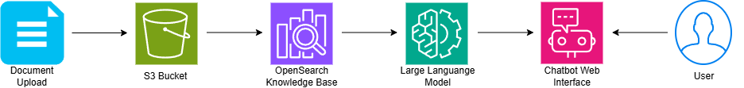

# RAG-Powered Chatbot with Amazon Bedrock

This project implements a **Retrieval-Augmented Generation (RAG)** chatbot that answers questions from your own documents using AWS serverless services. It leverages **Amazon Bedrock** for embeddings and LLM generation, **Amazon OpenSearch Serverless** as a vector database, and integrates advanced features like conversation memory, query augmentation, and a document management dashboard.

---

## 📋 Overview & Architecture

The chatbot processes user questions by retrieving relevant document chunks from a vector store, augmenting the prompt with context, and generating an answer using a foundation model. The system is fully serverless and scales automatically.



---

## 🚀 Phase 1: Foundation Setup

### 1.1 Enable Bedrock Model Access
1. Go to **Amazon Bedrock Console** → **Model access**.
2. Request access to:
   - **Titan Text Embeddings** – for vector embeddings.
   - **Claude 3 Sonnet** (or your preferred model) – for generation.
3. Wait for access approval (can take a few minutes).

### 1.2 Create S3 Buckets

### 1.3 Create IAM Roles
1. **Lambda Execution Role** (for chatbot Lambda):
   - Trusted entity: AWS Lambda
   - Attach managed policies: `AWSLambdaBasicExecutionRole`, `AmazonBedrockFullAccess`, `AmazonS3ReadOnlyAccess`
   - Create inline policies later for DynamoDB, Comprehend, and OpenSearch (if not covered).
2. **Management Lambda Role** (for dashboard backend):
   - Similar, plus permissions for `bedrock:ListIngestionJobs` and `bedrock:StartIngestionJob`.

---

## 🔧 Phase 2: Knowledge Base Configuration

### 2.1 Create OpenSearch Serverless Collection
1. Go to **Amazon OpenSearch Service** → **Collections** → **Create collection**.
2. Choose **Vector search**.
3. **Name**: `rag-vector-store`
4. **Capacity**: 1 OCU (development), enable auto-scaling for production.
5. Note the **Collection endpoint** and **ARN**.

### 2.2 Create Bedrock Knowledge Base
1. In **Bedrock Console** → **Knowledge bases** → **Create knowledge base**.
2. **Name**: `Company-Docs-KB`
3. **IAM role**: Let Bedrock create a new one.
4. **Data source**: S3 → select your document bucket.
5. **Chunking strategy**: Start with **Default** (you'll optimize later).
6. **Embeddings model**: **Titan Text Embeddings**.
7. **Vector store**: **Amazon OpenSearch Serverless** → choose your collection.
8. Review and create.

### 2.3 Ingest Documents
Upload your PDFs (e.g., [AWS Well‑Architected Framework](https://docs.aws.amazon.com/pdfs/wellarchitected/latest/framework/wellarchitected-framework.pdf)) to the S3 bucket, then in the Knowledge Base console click **Sync**.

---

## 🤖 Phase 3: Chatbot Implementation

### 3.1 Chatbot Lambda Function
Create a Lambda function with Python 3.10+. Below is the enhanced code that includes conversation memory and query augmentation.

**Environment Variables**:
- `KNOWLEDGE_BASE_ID` – your KB ID
- `MODEL_ID` – e.g., `anthropic.claude-3-sonnet-20240229v1`
- `SESSION_TABLE` – DynamoDB table name (`ChatSessions`)

**Code** (save as `lambda_function.py`):
```python
import json
import boto3
import logging
import time
from typing import Dict, List, Any

logger = logging.getLogger()
logger.setLevel(logging.INFO)

# Initialize AWS clients
bedrock_agent_runtime = boto3.client('bedrock-agent-runtime')
bedrock = boto3.client('bedrock-runtime')
dynamodb = boto3.resource('dynamodb')
comprehend = boto3.client('comprehend')

# Initialize DynamoDB Table
session_table = dynamodb.Table('ChatSessions')

# Configuration
KNOWLEDGE_BASE_ID = "JKLGAG9CM3"
MODEL_ID = "apac.anthropic.claude-sonnet-4-20250514-v1:0"  # Or your preferred model

def get_conversation_history(session_id: str) -> List[Dict[str, str]]:
    """Retrieve previous messages from DynamoDB for the current session"""
    try:
        response = session_table.get_item(Key={'session_id': session_id})
        item = response.get('Item', {})
        return item.get('history', [])
    except Exception as e:
        logger.error(f"Error retrieving history: {e}")
        return []

def save_conversation_history(session_id: str, history: List[Dict[str, str]]):
    """Save updated message list back to DynamoDB"""
    try:
        session_table.put_item(Item={
            'session_id': session_id,
            'history': history,
            'last_updated': str(int(time.time()))
        })
    except Exception as e:
        logger.error(f"Error saving history: {e}")

def extract_key_phrases(text: str) -> List[str]:
    """Use Comprehend to extract key phrases from the question."""
    try:
        response = comprehend.detect_key_phrases(
            Text=text,
            LanguageCode='en'
        )
        return [phrase['Text'] for phrase in response['KeyPhrases']]
    except Exception as e:
        logger.error(f"Comprehend error: {e}")
        return []

def generate_query_variations(question: str) -> List[str]:
    """Create alternative queries for better retrieval."""
    variations = [question]  # start with original
    
    # 1. Extract key phrases and create a concise query
    key_phrases = extract_key_phrases(question)
    if key_phrases:
        variations.append(" ".join(key_phrases))
        
    # 2. Add a version without common stopwords
    stopwords = {"a", "an", "the", "is", "what", "how", "where", "when", "who"}
    words = question.split()
    filtered = " ".join([w for w in words if w.lower() not in stopwords])
    if filtered and filtered != question:
        variations.append(filtered)
        
    # Remove duplicates while preserving order
    seen = set()
    return [x for x in variations if not (x in seen or seen.add(x))]

def build_prompt_with_history(question: str, contexts: List[str], history: List[Dict[str, str]]) -> str:
    """Combine conversation history, retrieved contexts, and the new question."""
    history_text = ""
    for msg in history[-5:]:  
        role = "Human" if msg['role'] == 'user' else "Assistant"
        history_text += f"{role}: {msg['content']}\n"
    
    context_text = "\n\n".join(contexts)
    
    prompt = f"""Human: You are a helpful assistant that answers questions based on the provided context and conversation history.
    Use only the information from the context provided. If the context doesn't contain relevant information, say "I don't have enough information to answer that question."

    Conversation history:
    {history_text}

    Current context from company documents:
    <context>
    {context_text}
    </context>

    Now answer this question: {question}

    Always cite your sources using the source references provided with the context.
    Format your answer clearly and concisely.

    Assistant:"""
    
    return prompt

def query_knowledge_base(question: str, kb_id: str, max_results: int = 5):
    """Retrieve relevant chunks from the knowledge base"""
    try:
        response = bedrock_agent_runtime.retrieve(
            knowledgeBaseId=kb_id,
            retrievalQuery={'text': question},
            retrievalConfiguration={
                'vectorSearchConfiguration': {
                    'numberOfResults': max_results,
                    'overrideSearchType': 'SEMANTIC'
                }
            }
        )
        
        contexts = []
        source_metadata = []
        
        for result in response.get('retrievalResults', []):
            content = result.get('content', {}).get('text', '')
            contexts.append(content)
            
            metadata = result.get('metadata', {})
            raw_page = metadata.get('x-amz-bedrock-kb-document-page-number', 
                          metadata.get('pageNumber', 
                          metadata.get('page', 'N/A')))
            
            try:
                page_number = int(float(raw_page))
            except (ValueError, TypeError):
                page_number = raw_page

            source_uri = metadata.get('x-amz-bedrock-kb-source-uri', metadata.get('source', 'Unknown'))
            file_name = source_uri.split('/')[-1] if '/' in source_uri else source_uri

            source_metadata.append({
                'source': file_name,
                'page': page_number,
                'score': result.get('score', 0)
            })
        
        return contexts, source_metadata
        
    except Exception as e:
        logger.error(f"Knowledge base query failed: {str(e)}")
        raise

def retrieve_from_multiple_queries(question: str, kb_id: str, max_results: int = 3):
    """Run multiple queries and combine unique results."""
    all_contexts = []
    all_sources = []
    seen_texts = set()
    
    query_variations = generate_query_variations(question)
    logger.info(f"Generated query variations: {query_variations}")
    
    for q in query_variations[:3]:  # limit to 3 variations to keep cost reasonable
        contexts, sources = query_knowledge_base(q, kb_id, max_results)
        
        for ctx, src in zip(contexts, sources):
            # deduplicate by content
            if ctx not in seen_texts:
                seen_texts.add(ctx)
                all_contexts.append(ctx)
                all_sources.append(src)
                
        # if we already have enough combined unique results, stop
        if len(all_contexts) >= max_results * 2:
            break
            
    return all_contexts, all_sources

def generate_answer(prompt: str):
    """Generate answer using Bedrock foundation model"""
    try:
        messages = [{
            "role": "user",
            "content": [{"text": prompt}]
        }]
        
        response = bedrock.converse(
            modelId=MODEL_ID,
            messages=messages,
            inferenceConfig={
                "maxTokens": 2048,
                "temperature": 0.7,
                "topP": 0.9
            }
        )
        
        answer = response['output']['message']['content'][0]['text']
        return answer
        
    except Exception as e:
        logger.error(f"Generation failed: {str(e)}")
        raise

def lambda_handler(event, context):
    """Main Lambda handler for chatbot queries"""
    try:
        body = json.loads(event.get('body', '{}'))
        question = body.get('question', '')
        session_id = body.get('session_id', 'default_session')
        
        if not question:
            return {
                'statusCode': 400,
                'body': json.dumps({'error': 'No question provided'})
            }
        
        logger.info(f"Processing question: {question} for session: {session_id}")
        
        # Step 1: Retrieve History
        history = get_conversation_history(session_id)
        
        # Step 2: Retrieve relevant context (Using the new multi-query function)
        # We fetch up to 3 results per variation to blend them together.
        contexts, sources = retrieve_from_multiple_queries(question, KNOWLEDGE_BASE_ID, max_results=3)
        
        if not contexts:
            fallback_answer = 'I could not find relevant information in the documents.'
            history.append({"role": "user", "content": question})
            history.append({"role": "assistant", "content": fallback_answer})
            save_conversation_history(session_id, history)
            
            return {
                'statusCode': 200,
                'body': json.dumps({
                    'answer': fallback_answer,
                    'sources': [],
                    'session_id': session_id
                })
            }
        
        # Step 3: Build RAG prompt with History
        prompt = build_prompt_with_history(question, contexts, history)
        
        # Step 4: Generate answer
        answer = generate_answer(prompt)
        
        # Step 5: Update and Save History
        history.append({"role": "user", "content": question})
        history.append({"role": "assistant", "content": answer})
        save_conversation_history(session_id, history)
        
        # Step 6: Format response
        response = {
            'answer': answer,
            'sources': sources[:5],  # Adjusted to return the top 5 blended sources
            'session_id': session_id,
            'context_count': len(contexts)
        }
        
        return {
            'statusCode': 200,
            'headers': {
                'Content-Type': 'application/json',
                'Access-Control-Allow-Origin': '*'
            },
            'body': json.dumps(response)
        }
        
    except Exception as e:
        logger.error(f"Error in lambda_handler: {str(e)}")
        return {
            'statusCode': 500,
            'body': json.dumps({'error': str(e)})
        }
```

### 3.2 API Gateway Setup
1. Create a **REST API** named `ChatbotAPI`.
2. Create a `POST /query` method integrated with the Lambda function.
3. Enable CORS.
4. Deploy to a stage (e.g., `prod`). Note the invoke URL.

### 3.3 Simple Frontend (Streamlit)
1. Create `app.py` (Code attach in folder)
2. Run locally: `streamlit run app.py`

---

## 📊 Monitoring & Optimization

### 4.1 CloudWatch Metrics & Alarms
- **UserErrors** (Bedrock): Set alarm to notify on errors.
  ```bash
  aws cloudwatch put-metric-alarm \
    --alarm-name "Bedrock-UserErrors" \
    --metric-name UserErrors \
    --namespace AWS/Bedrock \
    --statistic Sum \
    --period 300 \
    --threshold 0 \
    --comparison-operator GreaterThanThreshold \
    --dimensions Name=KnowledgeBaseId,Value=YOUR_KB_ID \
    --alarm-actions arn:aws:sns:...
  ```
- **OpenSearch metrics**: Monitor `SearchLatency`, `IndexingRate` in OpenSearch console.

### 4.2 Chunking Strategy Optimization
In Bedrock Knowledge Base → Data source → Edit settings:

| Document Type        | Recommended Strategy               |
|----------------------|------------------------------------|
| Technical manuals    | Fixed chunk size 500–1000 tokens, overlap 10–20% |
| Contracts / policies | Semantic chunking (split by sections) |
| Emails / messages    | Custom pre‑processor to split by individual messages |

Test different strategies and evaluate retrieval quality.

---

## 💰 Cost Estimation (approx.)
- **Bedrock**: ~$0.01–$0.03 per 1k input tokens, $0.015–$0.06 per 1k output tokens (depending on model).
- **OpenSearch Serverless**: 1 OCU ~ $0.24/hour → ~$180/month (can be scaled down when idle).
- **Lambda**: negligible for moderate usage.
- **DynamoDB**: pay‑per‑request, usually < $5/month.
- **Total** for development: ~$200/month; production can be optimized with auto‑scaling.

---

## 🛠️ Troubleshooting

| Issue                          | Check                                                              |
|--------------------------------|--------------------------------------------------------------------|
| `UserErrors` > 0               | CloudWatch Logs for Lambda; ensure S3 bucket and OpenSearch are in same region. |
| No documents retrieved         | Verify KB sync status; check chunking strategy.                    |
| Lambda timeout                 | Increase timeout (up to 15 min); reduce max results or use async.  |
| OpenSearch slow                | Increase OCU capacity; check index mapping.                        |
| Dashboard shows no jobs        | Verify IAM permissions for `bedrock:ListIngestionJobs`.            |